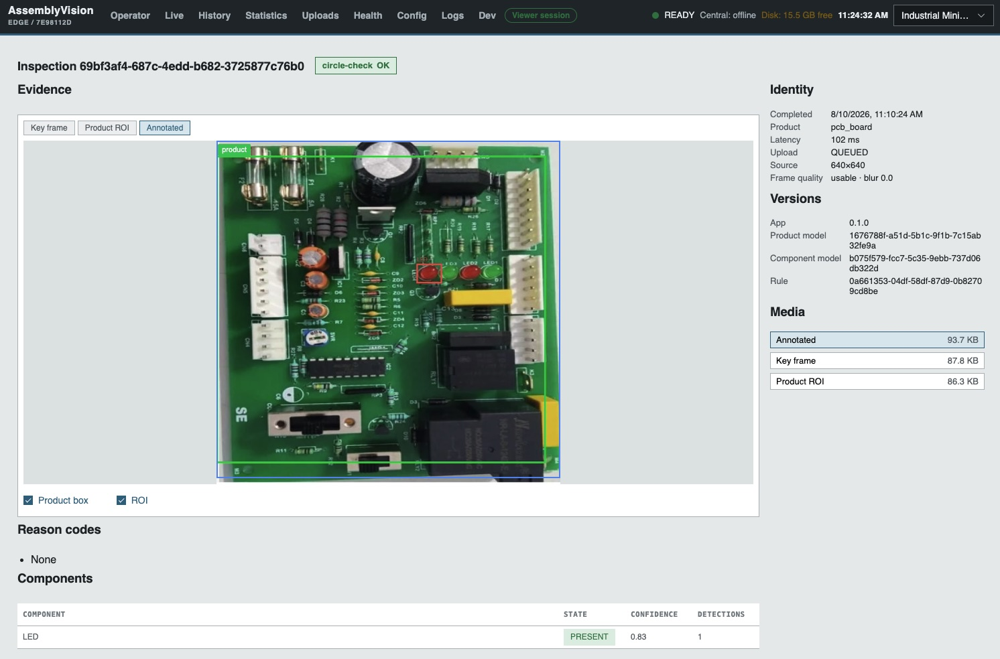
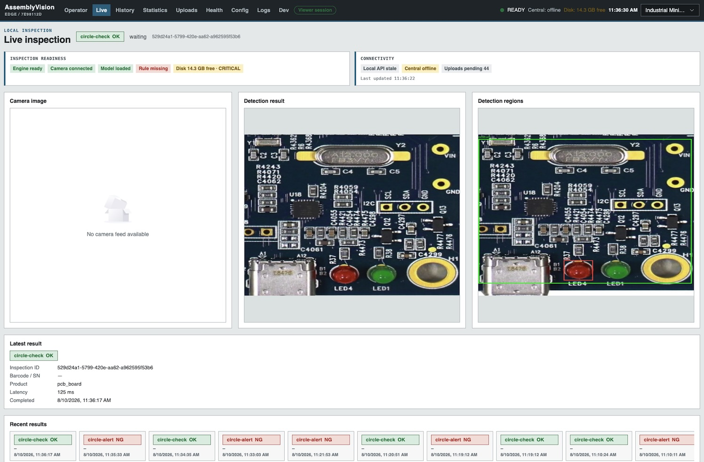
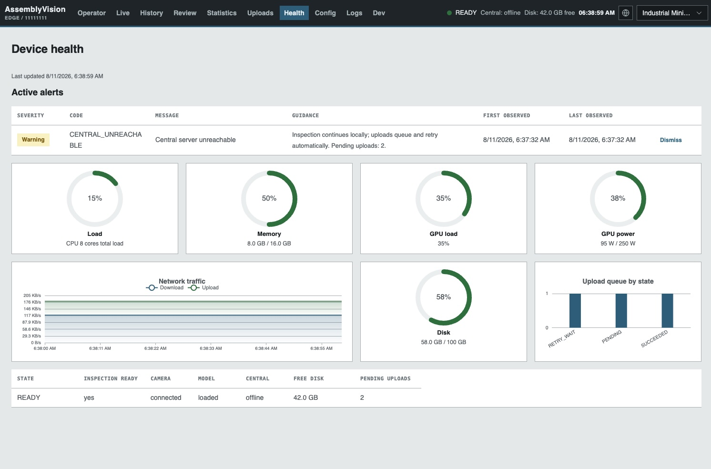
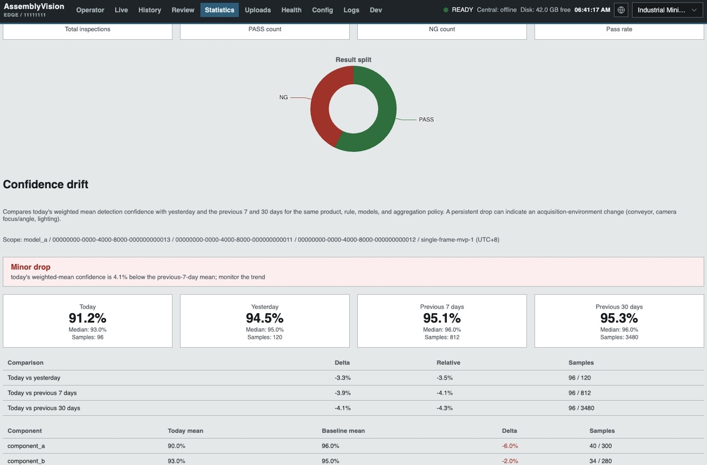
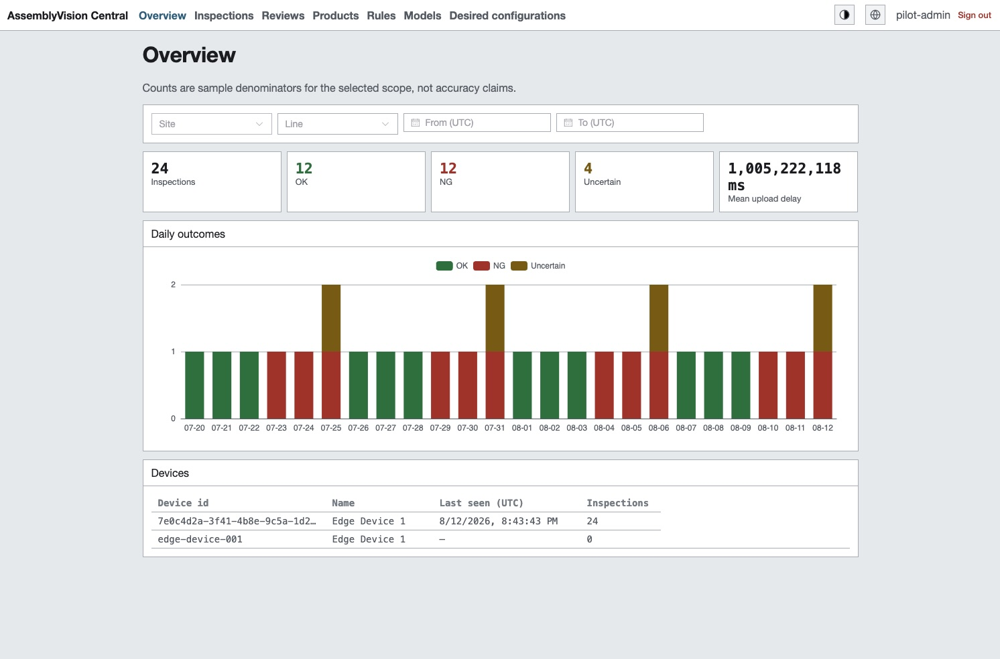
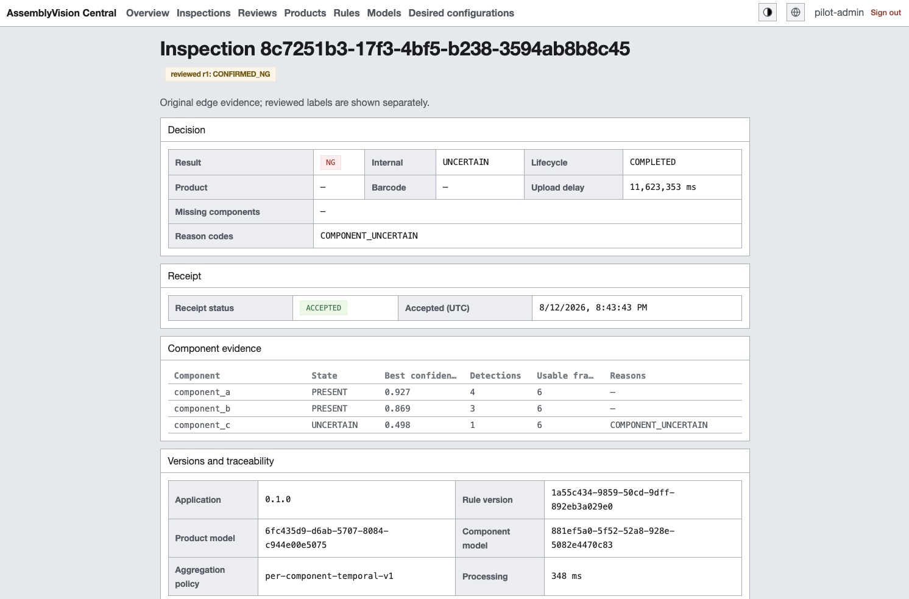
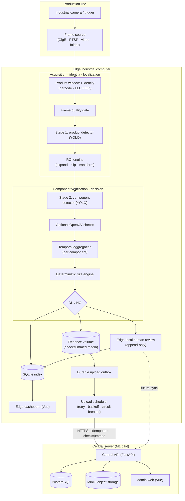

# AssemblyVision

[](https://github.com/dream-studio-china/assembly-vision/actions/workflows/ci.yml)
[](https://github.com/dream-studio-china/assembly-vision)
[](https://github.com/dream-studio-china/assembly-vision)
[](LICENSE)

**AssemblyVision** is an edge-first industrial AI vision inspection platform for
conveyor-based assembly lines. It verifies that every required component is
present on a completed product using two-stage YOLO detection and a
deterministic, versioned rule engine — and it does so **offline**, on an
industrial edge computer, without any central round-trip in the real-time
decision path.

> **Business output.** Every inspection resolves to `OK` (all required
> components reliably detected) or `NG` (missing, uncertain, or unverifiable).
> The quality priority is **minimizing false negatives**: an unverifiable
> result is always reported as `NG`, never as a default `OK`. The system makes
> no 100 % accuracy claims; acceptance is based on measured, held-out evidence.

## Screenshots

| Edge - Inspection detail view | Edge - Live inspection view |
|:---:|:---:|
|  |  |

| Edge - Health view | Edge - Statistics view |
|:---:|:---:|
|  |  |

| Central - Overview | Central - Inspections view |
|:---:|:---:|
|  |  |

## Production Status

The Edge production-candidate gates E1–E5 are merged, and the Central server
M1 pilot is **feature-complete** (C1a–C6 delivered, including the E6-A16 real
edge-to-central integration fixture and the M1 exit-criteria evidence).
Central never appears in the real-time inspection path, and M1 preserves the
current Edge upload envelope and verified-receipt semantics. M1 is a
**controlled pilot**: production hardening (OIDC/RBAC, remote rollout,
resumable uploads, retention enforcement, DR/RPO-RTO) remains deferred; the
go-live deployment checklist is in the [M1 plan](docs/tasks/C1-central-server-m1.md) §13.2.

| Milestone | Status |
|---|---|
| E1 Observability | Merged (PRs #18/#19) |
| E2 Retention and disk safety | Merged (PR #20) |
| E3 Upload resilience | Merged (PR #22) |
| E4 Runtime and live event channel | Merged (PR #23) |
| E5 Deployment and security | Merged (PR #24) |
| E6 Edge acceptance | E6-prep tooling merged (PR #25); clock-drift harness and on-site acceptance remain open |
| Barcode identity / PLC FIFO trigger (ADR-015) | Merged (PR #30) |
| Edge-local human review (ADR-016) | Merged (PR #31) |
| Central server (M1 pilot) | Feature-complete — C1a–C6 delivered (ingestion, media, history/detail, review, metadata governance, hardening) plus the E6-A16 edge-to-central integration fixture; controlled-pilot deployment checklist in task §13.2 ([plan](docs/tasks/C1-central-server-m1.md)) |

**E6 edge acceptance** is split into two phases. The **E6-prep** deliverables
need no real environment and are delivered: the acceptance test matrix
(`docs/tasks/E6-edge-acceptance.md`), the local automation runner
(`scripts/edge-acceptance-run.py`) that emits a machine-readable evidence
manifest with `NOT_EXECUTED` entries for on-site items, the acceptance report
template (`docs/design/28-edge-acceptance-report.md`), and the on-site
execution plan. The **on-site acceptance** phase cannot run in this
repository's environment: it requires customer-approved targets, real edge
hardware (camera/SDK, barcode, PLC/photo-eye trigger, GPU), unseen customer
data, and executed resilience/soak evidence. Until that evidence exists the
acceptance report stays a template with `NOT_MEASURED` metrics; no fabricated
pass results are ever recorded.

## Features

**Decision integrity**

- **Two-stage detection** — stage one localizes the product in the full frame, the ROI engine expands and clips it, stage two verifies each required component inside the ROI
- **Per-component temporal aggregation** — evidence is combined across product-window frames per required component (no whole-product majority voting), improving robustness without changing single-frame model accuracy
- **Deterministic rule engine** — versioned, model-independent, and fail-safe: only complete, valid evidence may produce `OK`; `UNCERTAIN` always maps to business `NG`
- **Full traceability** — every decision pins the product/component model versions and checksums, the rule version, and the product configuration version

**Edge-first operations**

- **Offline inspection** — all production-critical inference and decisions run on the edge industrial computer; inspection continues through central and network outages
- **Durable upload outbox** — transactional queue with retry/backoff, idempotency keys, verified receipts, bandwidth throttling, and a circuit breaker (ADR-005, E3)
- **Retention and disk safety** — receipt-gated cleanup with lease fencing, startup integrity scanning/quarantine, and a fail-safe stop gate under disk pressure that never returns an unrecorded `OK` (E2)
- **Live event channel** — WebSocket runtime feed (`inspection.started`/`completed`, `device.status_changed`, `upload.changed`) with bounded buffers that disconnect slow consumers instead of blocking the runtime (E4)
- **Barcode identity and PLC trigger** — exact-mapped barcode identity resolution and an opt-in Modbus TCP FIFO trigger contract that correlate physical products to windows (ADR-015)
- **Edge-local human review** — optional, append-only review of any inspection (OK or NG) that never rewrites the immutable machine decision (ADR-016)

**Plant integration**

- **Camera sources** — folder, video, OpenCV device, RTSP, HTTP-image, and a hardened GigE/GenICam source; multi-instance `serve` pairs each camera with its own models/rule/product
- **Operator dashboard** — Vue 3 + TypeScript UI (inspection detail, live view, history, traceability, statistics, device status, images, upload queue, review queue, health) decoupled from the backend by a typed API client
- **Edge desktop** — Electron shell running the dashboard as a local desktop/kiosk app

**Central management plane (M1 pilot)**

- **Central service** — FastAPI application (`apps/central-service`) with PostgreSQL persistence, MinIO object storage behind a typed abstraction, controlled schema migrations (never auto-applied by the API), and a fail-closed `/health/ready` dependency probe
- **Idempotent ingestion with verified receipts** — accepts the current edge envelope (inspection + media) duplicate-free: identical replay returns the original receipt, payload conflicts fail closed with `409`, and media bytes are checksum-verified against the parent inspection manifest before binding
- **History, detail, and media access** — cross-device history with bounded filters and keyset pagination, full inspection detail with version traceability, and authorized media streaming from MinIO
- **Append-only human review** — central review of NG/uncertain inspections with optimistic concurrency (`If-Match`) and idempotency keys; the original machine decision stays byte-for-byte unchanged
- **Metadata governance** — organization-scoped products, components, rules, and model packages with immutable draft/publish versions, exact barcode mappings, rule/model compatibility validation, and single-device desired configuration recording (manual installation; assignment is never presented as activation)
- **Pilot hardening** — request-ID log correlation, per-client rate limiting (`429` + `Retry-After`), retryable dependency failures (`503`), and restart/backup-restore fault evidence; central runbooks cover ingestion backlog, object-store failure, credential compromise, backup/restore, and pilot upgrade/rollback
- **Pilot administration UI** — Vue 3 `admin-web` (overview, history/detail, review queue, read-only configuration pages) served behind an nginx proxy to the API
- **Typed central contract** — committed OpenAPI document with generated `api-client-central` TypeScript types and CI drift checks

**Engineering**

- **Python monorepo** — uv workspace, strict typing (MyPy), Pydantic domain models shared between `domain` and `vision-core`
- **Frontend workspace** — pnpm workspace with a generated TypeScript API contract and shared UI primitives
- **Bilingual documentation** — English/Chinese MkDocs site generated from `docs/` (design, ADRs, contracts, runbooks)

## Architecture



The edge makes every inspection decision; the central server is never in the
real-time path. The edge runs as a CLI (`assemblyvision inspect`/`verify`) and
as a local FastAPI service (`assemblyvision serve`) that serves the Vue
dashboard through a decoupled typed client. The service persists every
inspection and its upload tasks atomically, retries uploads from a durable
queue with idempotency and verified receipts, enforces receipt-gated retention
cleanup, and fails closed under disk pressure or integrity faults — an
unrecorded `OK` is never possible. Human-review dispositions are recorded
locally (ADR-016) and never rewrite the machine decision.

The central M1 pilot (`docs/tasks/C1-central-server-m1.md`) implements the
bounded management plane: idempotent ingestion of the current edge envelope,
PostgreSQL history, MinIO evidence, append-only review, governed metadata,
and pilot administration, delivered as `apps/central-service` and
`apps/admin-web`. The real edge scheduler/`HttpUploadSink` are verified
against the central API end to end (E6-A16 fixture), and the M1 exit
criteria are recorded with evidence in the plan's §13.1. Central
unavailability never blocks or alters an edge inspection decision.

## Quickstart

```bash
git clone https://github.com/dream-studio-china/assembly-vision.git
cd assembly-vision
git checkout dev            # `dev` is the development branch, kept in sync with `main`
uv sync                     # Python workspace
pnpm install                # TypeScript workspace (frontend)
```

Verify everything:

```bash
uv run ruff check .                                    # Python lint
uv run mypy .                                          # Python type check
uv run pytest                                          # Python tests

pnpm -r build && pnpm -r lint && pnpm -r test          # frontend build/lint/unit tests
```

Run the inspection CLI:

```bash
uv run assemblyvision inspect /path/to/images \
  --config config/examples/pipeline.yaml \
  --rule  config/examples/product-rule.yaml \
  --output out/
```

Run the edge dashboard (mock data, no backend required):

```bash
pnpm --filter edge-web dev        # http://localhost:5173
```

Run the dashboard as a local desktop/kiosk app:

```bash
pnpm --filter edge-web build && pnpm --filter edge-desktop start
```

Run the central M1 pilot stack (PostgreSQL + MinIO + API + admin-web):

```bash
cp apps/central-service/compose.env.example apps/central-service/.env   # dev defaults; override secrets for real use
docker compose -f apps/central-service/compose.yaml up -d --build
curl http://localhost:8080/api/v1/health/live        # via the admin-web proxy
```

Schema migrations are a controlled release step (the one-shot `central-migrate`
service in the stack; the API never migrates automatically).

See [QUICKSTART.md](QUICKSTART.md) for a detailed walkthrough, structured
per app: section 4 covers the edge inspection CLI, section 5 the edge
dashboard, section 6 the edge desktop shell, section 7 the central server
pilot.

## Usage

```bash
assemblyvision inspect images/ --config pipeline.yaml --rule rules.yaml --output out/
```

Each image gets an output directory with a versioned JSON record and annotated
media. Per-image machine-readable output:

```text
img/product_001.jpg  NG  INFERENCE_ERROR,GATE_FAILED:product_detected,...  <inspection_id>
```

## Project Structure

```text
apps/
  central-service/          # central M1 API (FastAPI · PostgreSQL · MinIO)
  admin-web/                # central administration UI (Vue 3)
  edge-service/             # inspection runtime (CLI, pipeline, rules, detectors)
  edge-web/                 # Vue 3 edge dashboard (Vite)
  edge-desktop/             # Electron shell for the dashboard (desktop/kiosk)
packages/
  python/
    domain/                 # canonical Pydantic models, errors, reason codes
    vision-core/            # ROI geometry, image sources, manifest loading
  typescript/
    api-client/             # edge API contract (types, Mock/HTTP client)
    api-client-central/     # central API contract (generated types)
    ui/                     # shared UI primitives (detection viewer, status)
config/examples/            # pipeline, rule, and manifest examples
models/manifests/           # model metadata (weights outside Git)
scripts/                    # dataset adapters (Roboflow / X-AnyLabeling), e2e demo, E6 acceptance runner
docs/                       # architecture, contracts, ADRs, runbooks
```

## Documentation

| Document | Purpose |
|---|---|
| [Cover and status](docs/design/00-cover-and-status.md) | Scope horizons and decisions in force |
| [Roadmap](docs/design/25-roadmap.md) | Implementation sequence by phase |
| [Architecture overview](docs/design/03-architecture-overview.md) | System context, deployment, data flow |
| [Edge client](docs/design/04-edge-client-architecture.md) | Offline runtime and ingestion |
| [Requirements](docs/design/02-requirements.md) | Functional and quality requirements |
| [Single-product data acquisition](docs/design/19-training-and-evaluation.md#1917-single-product-data-acquisition-and-annotation-checklist) | What to collect and how to annotate the real-data baseline |
| [E6 edge acceptance (matrix)](docs/tasks/E6-edge-acceptance.md) | E6-prep vs on-site split and the mandatory acceptance test matrix |
| [Edge acceptance report template](docs/design/28-edge-acceptance-report.md) | Evidence-based report structure with `NOT_MEASURED` defaults |
| [Central server M1 plan](docs/tasks/C1-central-server-m1.md) | Bounded pilot scope: ingestion, history, review, pilot auth, Compose |
| [Decisions (ADRs)](docs/design/decisions/README.md) | Why major architecture choices were made |
| [Contracts](docs/contracts/README.md) | Mandatory implementation constraints |
| [Runbooks](docs/runbooks/README.md) | Operational recovery procedures (incl. data collection and annotation) |
| [Security policy](SECURITY.md) | Vulnerability reporting and security position |

## Safety

Only complete, valid evidence for every required component may produce `OK`.
Missing, uncertain, or unverifiable evidence always yields `NG`. No claim of
100 % accuracy is made. Production acceptance requires measured data excluded
from training.

## Testing and Resilience

The resilience test matrix (design 22.8) and the testing contracts (contracts 06)
grade fault cases by delivery horizon: design cases → targeted pilot subset →
full approved suite. Covered faults include camera disconnect/reconnect, sudden
power loss, disk-full recovery, accelerator/GPU failure with validated CPU
fallback, repeated network disconnects with persistent queue drain, and
long-running soak stability (duration agreed from operating patterns). Recovery
procedures live in the runbooks (camera disconnection, low disk space, database
recovery, network recovery synchronization). The E6 acceptance matrix
([docs/tasks/E6-edge-acceptance.md](docs/tasks/E6-edge-acceptance.md)) classifies
every scenario by environment, and the local runner
(`scripts/edge-acceptance-run.py`, see QUICKSTART §9.1) executes supported
locally automatable items while on-site and unsupported items stay
`NOT_EXECUTED` until their required evidence is available.

## Developer Tools (web test harness)

A gated `/api/v1/dev/` endpoint group and a `/dev` dashboard page let you test
the inspection pipeline from any browser: take a photo with a phone camera,
upload an image, or upload a short video, and get the decision immediately
(ADR-014). These endpoints are **disabled by default** — start `serve` with
`--enable-web-test` to enable them. This is a test harness, not a production
acquisition path: it never streams video. Production real-time inspection uses
the native app / RTSP / camera sources. See [QUICKSTART](QUICKSTART.md) §4.8.

## Roadmap

| Phase | Status |
|---|---|
| **Phase 1 — MVP** | Delivered — static train-and-inspect pipeline, operator dashboard, and the read-only M1 edge API are on `main` (PRs #3/#6/#8) |
| **Phase 2 — Edge production readiness** | E1–E5 production gates, camera sources, temporal aggregation, upload outbox, barcode identity / PLC trigger (ADR-015), and edge-local human review (ADR-016, PR #31) are implemented; E6 on-site acceptance remains open |
| **Phase 3 — Central server** | M1 pilot delivered — C1a–C6 feature-complete (ingestion, media, history/detail, review, metadata governance, hardening) plus the E6-A16 edge-to-central integration fixture; controlled-pilot deployment per the task §13.2 checklist remains; production scope (OIDC/RBAC, remote rollout, resumable uploads) deferred ([C1 plan](docs/tasks/C1-central-server-m1.md)) |

### Outlook

AssemblyVision is designed to grow from a component-presence inspector into a
complete AI recognition platform for production lines:

- **Hardware adaptation** — the vendor-neutral frame-source protocol already
  ships GigE/GenICam; future adapters can add USB3 Vision and CoaXPress cameras,
  additional barcode symbologies and readers, and PLC/MES fieldbus transports
  (PROFINET, EtherNet/IP) alongside the Modbus TCP FIFO contract.
- **Inspection breadth** — beyond component-presence: surface-defect detection,
  OCR and label verification, dimensional measurement, and assembly-sequence
  validation — each feeding the same deterministic rule engine with full
  traceability and fail-safe semantics.
- **Platform extensibility** — pluggable frame sources, detector adapters, and
  rule operators; per-instance model weighting; staged, checksum-governed model
  and rule rollout; and a governed training backlog driven by review
  corrections.
- **Fleet and integration** — centralized fleet monitoring and analytics,
  MES/ERP integration for closed-loop quality management, and reporting that
  turns accumulated inspection evidence into process improvement.

## License

MIT © 2026 dream-studio-china
