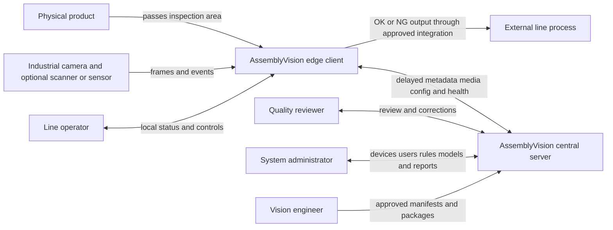
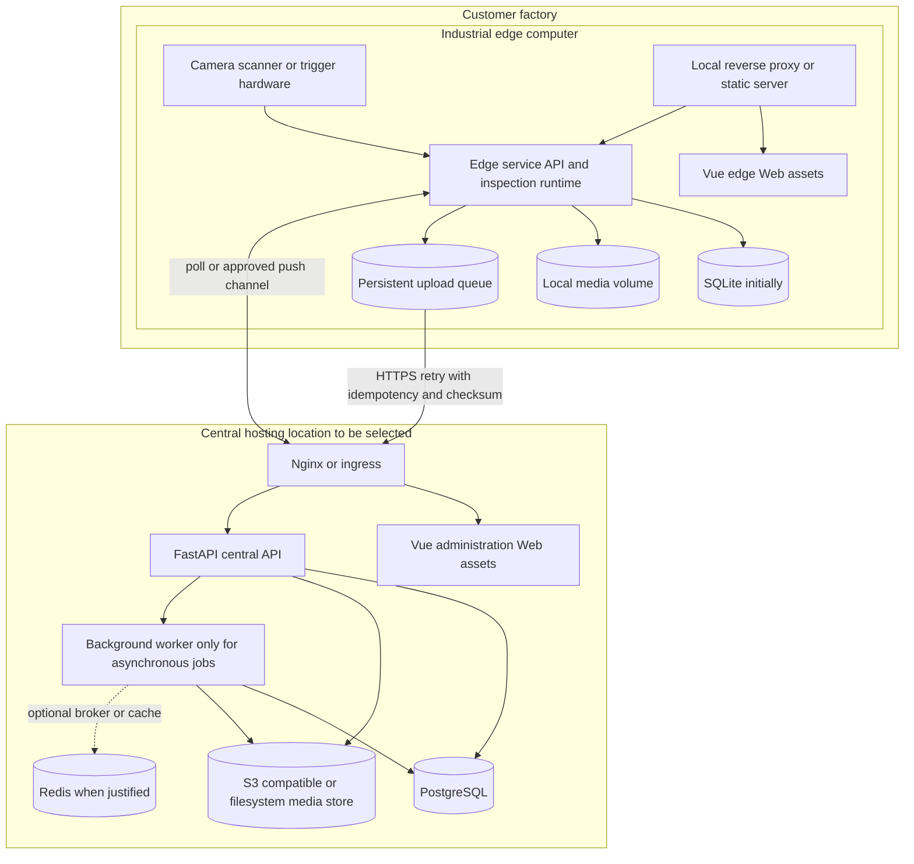

# AssemblyVision Architecture Overview

## 1. Architectural Drivers

AssemblyVision must make conservative product decisions in a controlled but not perfectly registered imaging environment, remain operational through network and central outages, preserve reproducible evidence, and evolve from a labeled static-image train-and-inspect proof to an accepted production system. The result is an edge-first architecture with asynchronous central synchronization.

Detailed obligations are in [Requirements](02-requirements.md); shared terms and decision rules are in [Appendices](appendices.md).

## 2. System Context

The external line process is shown as a boundary; the exact mechanism and whether AssemblyVision actuates equipment are unresolved. The central server never participates synchronously in an inspection decision.

## 3. Logical Architecture

### 3.1 Edge Decision Plane

The edge decision plane owns acquisition, product-window correlation, barcode/product resolution, frame quality, product detection, ROI generation, component detection, optional OpenCV checks, per-component temporal aggregation, deterministic rule evaluation, and durable local recording. It exposes local status and queues selected records for upload. See [Edge Client Architecture](04-edge-client-architecture.md).

### 3.2 Central Management Plane

The central plane ingests completed edge records and evidence, presents fleet/history/reporting/review workflows, manages users and audit, and prepares versioned configurations for delayed edge distribution. See [Central Server Architecture](05-central-server-architecture.md).

### 3.3 Training and Release Plane

Offline training/evaluation produces product and component detector artifacts, manifests, and reports. Approval precedes distribution; activation occurs only after edge-side integrity and compatibility validation. Training is not triggered directly by review corrections, and production packages are immutable.

## 4. Edge and Central Deployment

Docker Compose is the deployment baseline for edge and central. Edge services use explicit persistent volumes and do not depend on Kubernetes. Central Kubernetes remains a future scaling option, not an architectural prerequisite.

## 5. Primary Data Flow

1. A validated trigger/window mechanism creates a globally unique edge inspection ID and captures related frames.
2. Barcode decoding and other configured identity sources resolve a product type; disagreement is recorded conservatively.
3. Frame quality gates unusable frames. Stage-one YOLO detects the product in each usable full frame.
4. The ROI engine expands and clips the product box, records coordinate transforms, and optionally applies validated orientation/perspective normalization.
5. Stage-two YOLO detects configured components in the ROI; optional OpenCV checks add typed evidence rather than overriding model output silently.
6. The temporal aggregator combines evidence per required component using the active versioned policy.
7. The deterministic rule engine produces an internal state, business result, component lists, and reason codes. Only complete valid evidence can yield `OK`.
8. A local transaction records metadata and media references. Media is finalized with checksums before dependent upload tasks become ready.
9. The local dashboard receives state updates and the persistent upload scheduler sends the outcome-specific envelope when connectivity permits.
10. The central service idempotently stores metadata, verifies media, returns receipts, and makes the record available for history/review/reporting.

## 6. Core Interface Contracts

| Interface | Contract principle | Failure behavior |
|---|---|---|
| Hardware adapter to inspection runtime | Timestamped frames/events plus explicit health state | Close or invalidate window; never infer healthy input |
| Pipeline stage to stage | Typed immutable value objects; coordinate-space and version metadata | Typed reason code and conservative decision |
| Worker to local persistence | Inspection and media manifest committed before upload eligibility | Recover incomplete work on restart |
| Edge API to edge Web | REST for state/history/control, WebSocket for transient live updates | UI falls back to polling; inspection continues |
| Edge to central | Versioned HTTPS REST envelope, idempotency key, checksums; resumable media strategy | Durable retry with bounded backoff and jitter |
| Central API to admin Web | Authenticated REST and WebSocket/SSE where justified | Display staleness and last successful update |
| Central to edge configuration | Immutable package, compatibility constraints, checksum/signature policy, staged acknowledgement | Keep last known-good active version |

OpenAPI is the source for generated TypeScript API clients. Domain event payloads use explicit schema versions; database rows are not exposed directly as API contracts.

## 7. Technology Baseline

| Area | Baseline |
|---|---|
| Python services | Python 3.12, FastAPI, Uvicorn (or Gunicorn centrally), Pydantic, SQLAlchemy, Alembic |
| Vision | Ultralytics YOLO, OpenCV, adapter-specific camera/barcode libraries |
| Edge persistence | SQLite initially; local filesystem volumes; optional PostgreSQL only for demonstrated larger installations |
| Central persistence | PostgreSQL; S3-compatible storage or filesystem abstraction |
| Async central work | Celery, Dramatiq, RQ, or equivalent only after workload/broker choice is justified; Redis only when required |
| Web | Vue 3, TypeScript, Vite, Router, Pinia, Axios or generated OpenAPI client, approved component library, ECharts, VueUse |
| Quality | Pytest, Ruff, MyPy, Vitest, ESLint, Prettier, structured logging |
| Runtime | Docker multi-stage builds, Compose, Nginx where appropriate, non-root users, health checks, restart policy |

Background execution is justified for media finalization, report/export generation, thumbnails, notification, and package preparation when these would make API requests slow or unreliable. Normal inspection does not depend on a central worker. The MVP should not add a broker merely to match the target diagram.

## 8. Reliability and Consistency Model

- Edge inspection records are authoritative for the original automated decision.
- Central ingestion is at-least-once transport with effectively-once persistence through `(device_id, inspection_id)` uniqueness, idempotency keys, payload hashes, and media checksums.
- A repeated identical request returns the existing receipt; a repeated key with different content returns a conflict and audit event.
- Configuration is eventually delivered but atomically activated locally. A running inspection pins versions at window start; updates apply only to a later window.
- The edge uses local monotonic time for durations/window ordering where possible and records wall-clock plus central receive time for traceability.
- Storage pressure, incompatible packages, camera faults, and unresolved identity make the system degraded/faulted and prevent an unjustified `OK`.

## 9. Security and Source Distribution

Central APIs require authenticated, authorized, encrypted transport. Device credentials must be unique and replaceable; no long-term secret is embedded in an image. Edge administrative controls should be protected according to the approved local threat model. Audit records cover configuration, model/rule activation, review, user/role changes, and evidence access where required.

Client images use multi-stage builds, built Web assets, non-root runtime, explicit volumes, and read-only filesystems where practical. Python may be distributed as compiled `.pyc` without original `.py` where practical, but `.pyc` and Docker do not prevent advanced reverse engineering. The accepted goal is avoiding casual source browsing; the Git repository, datasets, notebooks, and experiment configuration are not deployed.

## 10. Delivery Evolution

### 10.1 Static Train-and-Inspect MVP

Use a developer-only training CLI to produce product and component model artifacts from X-AnyLabeling YOLO labels. The in-process edge CLI consumes those artifacts to inspect folder inputs and write evidence while preserving future schemas and version fields. Training code is separate from, and is never imported by, the edge runtime.

### 10.2 One-Month Target

Run capture and decision work in bounded tasks, optionally in a supervised inference subprocess, so UI/API load cannot block capture without adding a second edge deployment unit prematurely. Add hardware adapters, product windows, SQLite/media volumes, queue scheduler, local Web assets, central ingestion/history, and initial administration. Deploy with Compose and exercise outages and restart recovery.

### 10.3 Production Target

Harden credentials, audit, package promotion/rollback, backups, retention, media integrity, observability, alerting, support procedures, schema migration, soak/failure tests, and controlled rollout. Acceptance gates are evidence-driven.

### 10.4 Future

Scale central workers/storage based on measurements; optionally adopt Kubernetes, edge PostgreSQL, desktop wrapping, external integrations, and approved retraining automation. Preserve the edge decision boundary.

## 11. Assumptions

- HTTPS connectivity is intermittently available for synchronization, but no reliability level is assumed.
- Device identity and credentials can be provisioned through an approved process.
- Local storage is durable enough for the required outage/retention interval once sized.
- Model runtimes can meet observed line timing on selected hardware; this must be benchmarked.
- One product-window mechanism can be validated against duplicate and mixed-frame cases.

## 12. Open Questions and Validation Required

1. What are the hardware, OS, accelerator, network route, and central hosting constraints?
2. What event opens/closes an inspection window, and how are duplicate/multiple products handled physically?
3. Which protocol delivers the result to the external line process, if any?
4. Are REST polling, WebSocket, or another approved channel appropriate for configuration delivery through the customer network?
5. Which device identity, PKI, encryption-at-rest, signing, and secret-rotation controls are required?
6. Which central asynchronous jobs justify a broker and Redis at expected scale?
7. What local and central recovery objectives, retention periods, and capacity margins apply?
8. See [Global Open Questions](appendices.md#3-global-open-questions).
