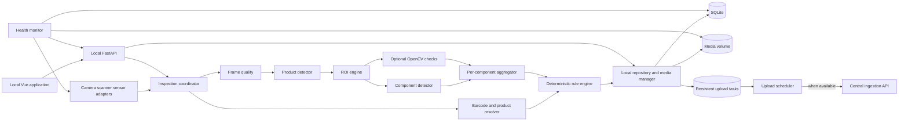
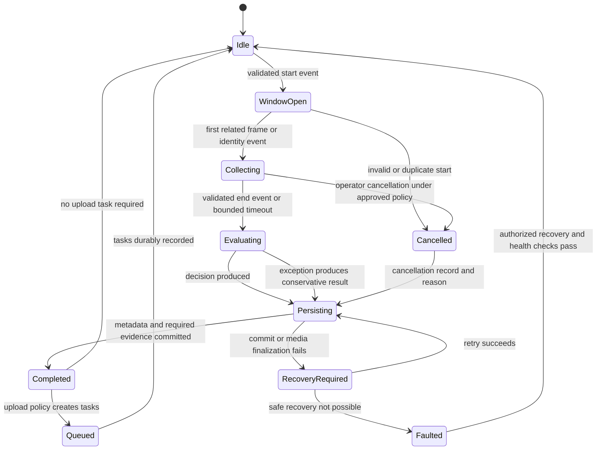
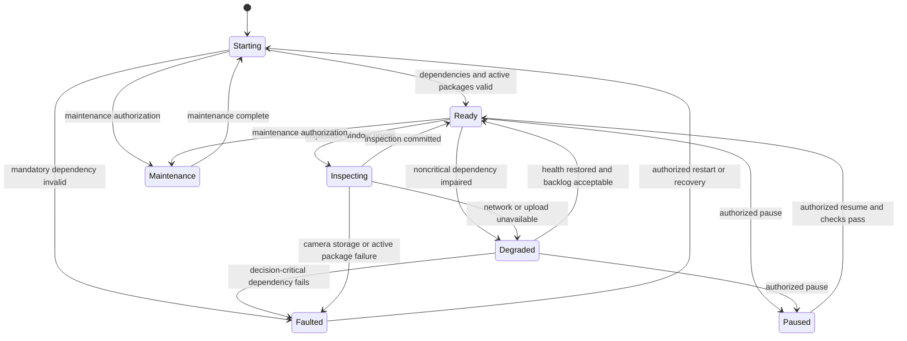

# AssemblyVision Edge Client Architecture

## 1. Responsibilities and Boundary

The edge client owns every operation needed to produce and retain a production decision: hardware capture, trigger/window management, barcode decoding, product-type resolution, two-stage vision, optional OpenCV checks, temporal aggregation, rules, local records/media, health, local API/Web UI, and delayed upload. It must inspect without the network or central server.

The edge does not train models, depend on central queries for active rules, or upload every frame. The broader boundary is shown in [Architecture Overview](03-architecture-overview.md).

## 2. Edge Component Architecture

The one-month target deploys one `edge-service` containing FastAPI, capture orchestration, persistence, and upload scheduling. Decision-critical work runs in bounded worker tasks and may use a supervised inference subprocess for SDK/GPU isolation; it is not a separately deployed service until measured isolation or scaling needs justify that complexity. API or browser request failure must not stop capture and decision tasks.

## 3. Inspection Processing

### 3.1 Window and Identity

The coordinator creates `inspection_id` before accepting evidence and pins active package versions. A hardware trigger gives the clearest boundary when available; barcode events add identity but may arrive late or fail; tracking/zones handle image-only flows but require careful tuning; a timeout bounds resource usage but cannot by itself prove physical separation. The production mechanism should combine only validated signals and test consecutive/multiple products explicitly.

Barcode output includes raw value, symbology if available, timestamp, source, read quality/status, and error. A versioned resolver maps identity to product configuration. No read, conflicting reads, unknown value, or absent configuration prevents `OK` and emits a reason code.

### 3.2 Two-Stage Vision

For each usable frame, the product detector processes the full image. The ROI engine selects an unambiguous product candidate, expands by configured margins, clips to bounds, and records transforms between full-frame and ROI coordinates. Zero-area, excessive clipping, no-product, or multiple-product ambiguity is invalid evidence.

The component detector runs on the generated ROI and emits class, box, confidence, frame ID, and model version. Required classes come from the pinned product configuration. Optional OpenCV checks emit named observations with their own algorithm/configuration version; they must not mutate detector output invisibly.

### 3.3 Per-Component Aggregation and Rules

The aggregator excludes invalid/blurred frames and evaluates each required component using a configured policy, for example one high-confidence observation, two medium-confidence observations, adjacent-frame evidence, visible-area limits, and minimum usable-frame count. Threshold values remain model/product specific and require evaluation.

The rule engine consumes only typed aggregate evidence and pinned configuration. It returns internal `OK`, `NG`, or `UNCERTAIN`, component lists, and reason codes. `UNCERTAIN` always maps to business `NG`; presentation may show the internal reason but cannot change the business result to `OK`.

## 4. Inspection State Model

Every terminal path creates an auditable record where storage remains available. A cancelled or exception path cannot yield `OK`.

## 5. Device State Model

Network or central failure is degraded, not decision-critical. Camera failure, invalid active model/rule compatibility, inability to persist mandatory records, or unsafe disk exhaustion is faulted. Exact line signaling for these states requires site agreement.

## 6. Local Persistence and Recovery

### 6.1 Data Layout

SQLite initially stores inspections, frame metadata, component evidence, media manifests, upload tasks, device events, local configuration, and installed model/rule versions. Media lives under an explicit mounted data root, partitioned by date and inspection ID, never inside the container layer or repository.

A practical write protocol is:

1. Write media to a temporary file in the target volume, flush it, calculate checksum and size, then atomically rename it.
2. In one database transaction, insert the inspection, evidence, finalized media manifests, and upload tasks.
3. Publish the completed event only after commit.
4. At startup, reconcile temporary files, incomplete inspections, missing files, and tasks left `IN_PROGRESS` by a crash.

SQLite uses Alembic migrations, foreign keys, WAL mode if validated on the selected filesystem, bounded busy timeout, regular integrity checks, and supported backup procedures. A single repository writer or short transactions reduce lock contention.

### 6.2 Retention and Disk Pressure

Retention classes are independently configured for full/rolling video, key frames, NG clips, annotated images, ROI images, logs, and database records. Cleanup proceeds from expired, successfully uploaded, unprotected artifacts to lower-value data. It must honor references, legal/review holds, pending/failed uploads, and minimum evidence policy. Warning and critical watermarks trigger reason-coded health events; inability to retain mandatory evidence faults or conservatively terminates inspection.

Exact durations and watermarks are intentionally unspecified pending capacity and policy validation.

## 7. Upload Scheduler

Upload tasks contain task ID, inspection ID, artifact type, local path where applicable, checksum, payload hash, attempt count, next-attempt time, and state. The idempotency key is stable across retries. Exponential backoff uses jitter and a configured cap; permanent validation/authentication failures stop automatic retry and raise an actionable event, while transient network/5xx failures remain queued.

Metadata is accepted before or with a media manifest. Large media should use a server-issued upload session or bounded multipart protocol when required by measured sizes. A central durable receipt marks success. Cleanup cannot remove protected local evidence merely because bytes were transmitted; it requires receipt and expiration policy.

## 8. Local API and Web Application

The versioned local API groups are `/api/v1/health`, `/api/v1/device`, `/api/v1/camera`, `/api/v1/inspection`, `/api/v1/inspections`, `/api/v1/media`, `/api/v1/uploads`, `/api/v1/configuration`, `/api/v1/logs`, and `/api/v1/ws/runtime`, as detailed in [REST API and Events](15-rest-api-and-events.md). Mutating calls use authorization appropriate to the local threat model, validation, audit entries, and idempotency where retried. WebSocket events are advisory; the UI restores truth via REST after reconnect.

The Vue application shows camera preview, current identity/product, latest result/evidence overlay, latency, camera/model/disk/network/central states, queue depth, recent records, local logs, and retry controls. It uses only local endpoints and remains useful offline. Preview delivery must be rate-limited and must not starve inference.

## 9. Process, Concurrency, and Backpressure

- A bounded capture buffer favors recent frames according to validated window policy; unbounded queues are prohibited.
- Inference concurrency is explicitly limited for selected CPU/GPU resources.
- Each frame carries inspection ID, frame ID, sequence, capture timestamp, and source; late results are discarded from a closed/different window and logged.
- Slow upload, UI, annotation rendering, or central calls cannot block capture/inference.
- Model activation occurs between windows using load/health checks and atomic active-version switching; the previous package remains available for rollback.
- Graceful shutdown stops new windows, gives an active window a bounded completion policy, commits state, and releases hardware.

## 10. Health and Observability

Structured logs and metrics cover capture rate/drops, usable frames, stage latency, product/ROI/barcode success, per-result/reason counts, queue age/depth, retry outcomes, disk watermarks, DB errors, package versions, and service restarts. Correlation uses device, inspection, frame, upload task, and request IDs. Health endpoints distinguish liveness, readiness, and detailed operational state; a camera-disconnected process may be live but not inspection-ready.

## 11. Deployment and Source Packaging

The edge uses Compose without Kubernetes. Images are multi-stage, run non-root, declare health/restart policies, and mount configuration/data/media/log volumes explicitly. Runtime filesystems are read-only where adapters permit it. Frontend source is compiled to static assets. Python `.pyc`-only packaging may reduce casual browsing, but it is not robust obfuscation; no Git history, training data, notebook, production data, experiment settings, or embedded long-term secret is shipped.

## 12. Delivery Horizons

### 12.1 Static Train-and-Inspect MVP

Implement an edge CLI path with folder source, trained model adapters, ROI, component evidence, rules, JSON/media output, held-out verification, and focused tests. A separate developer-only training CLI produces model artifacts; it is not part of the edge runtime.

### 12.2 One-Month Target

Add selected hardware adapters, product windows, barcode resolver, bounded decision workers within `edge-service`, SQLite/media manager, aggregation, queue/retry, local Web UI, Compose, and recovery/health testing. Integrate initial central ingestion without introducing it into decisions.

### 12.3 Production Target

Validate timing/hardware, harden migrations/backups/retention, credentials, package signing/rollback, failure states, long-running operation, support diagnostics, and acceptance metrics. Perform cautious rollout with NG review and sampled OK audits.

### 12.4 Future

Consider Tauri, larger edge PostgreSQL, PLC/MES adapters, advanced tracking, and remote package automation only through explicit requirements and validation.

## 13. Assumptions

- Hardware SDKs can be isolated behind adapters and permit recoverable reconnect.
- The selected host supports container access to hardware and durable mounted storage.
- Product throughput allows bounded two-stage inference after hardware benchmarking.
- An approved process can supply active packages before the edge loses connectivity.

## 14. Open Questions and Validation Required

1. Which camera/scanner/sensor vendors, SDKs, trigger modes, pixel formats, and reconnect behaviors apply?
2. What OS, CPU/GPU, memory, disk type/capacity, and container runtime are supported?
3. What opens/closes a window, what is the observed conveyor timing, and can products overlap in view?
4. What frame-quality, ROI, confidence, aggregation, and timeout thresholds are validated per product/model?
5. What local evidence is mandatory before reporting a result externally, especially under disk pressure?
6. What retention, privacy, encryption, local access control, and maintenance policies apply?
7. What protocol and safe-state behavior connect results/device faults to the production line?
8. What level of source packaging beyond casual-browsing deterrence is contractually required?
9. See [Global Open Questions](appendices.md#3-global-open-questions).
