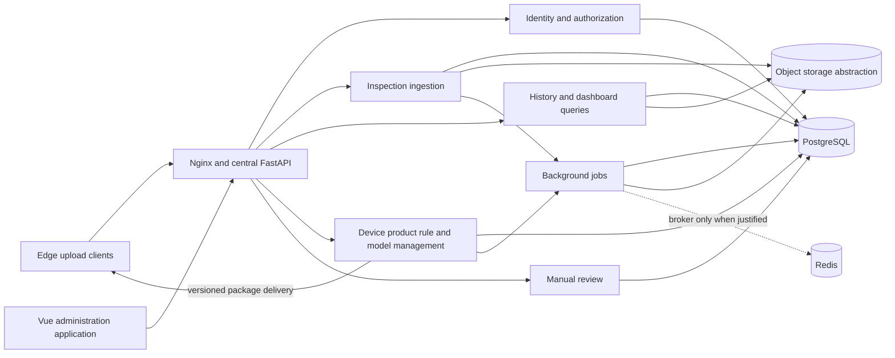

# AssemblyVision Central Server Architecture

## 1. Responsibilities and Boundary

The central server receives delayed inspection results and selected evidence, maintains cross-device history and reporting, manages devices/products/rules/models/users, supports manual review, records audit events, and distributes approved configuration. It is a management and evidence plane, never a synchronous dependency of production inspection.

Original automated decisions are append-only facts from the edge. Central reviews and corrections are linked facts; they do not overwrite the original result. See [Architecture Overview](03-architecture-overview.md) and [Edge Client Architecture](04-edge-client-architecture.md).

## 2. Central Component Architecture

Modules may begin in one FastAPI deployable with clear domain boundaries. Separate services are introduced only for measured scaling, isolation, or ownership needs. A worker is justified for long-running media derivatives, exports/reports, notifications, package assembly, and integrity/reconciliation scans, not simple CRUD.

## 3. Ingestion Architecture

### 3.1 Inspection Envelope

The edge posts a versioned envelope containing identity, timestamps, product resolution, business/internal outcomes, components and aggregate evidence, reason codes, frame/ROI summary, immutable versions, and a media manifest. The server authenticates the device, validates schema and size, verifies device ownership/status and compatible references, calculates a canonical payload hash, and persists in a transaction.

`(device_id, inspection_id)` and the idempotency key are unique. Identical retries return the prior receipt. A reused identity/key with a different canonical hash returns `409 Conflict`, records a security/data-integrity event, and preserves the original. The receipt includes central record ID, accepted schema version, server receive time, and media upload state.

### 3.2 Media Transfer

OK normally contributes one representative frame. NG contributes multiple key frames, annotation, ROI, and optionally a short event clip. Exceptions contribute bounded diagnostic evidence. The API may accept small media directly initially; production should use validated size limits and optionally issued upload sessions for larger objects.

Bytes are staged, checksum/size verified, then finalized under an opaque storage key. PostgreSQL stores media type, checksum, size, content type, status, retention class, and object key, not public filesystem paths. Partial/orphan uploads are reconciled asynchronously. Retrieval uses authorized API streaming or time-limited links according to the security model.

## 4. Domain and Persistence Model

Core PostgreSQL aggregates are:

- Tenant/location: organizations, sites, production lines, and devices, where the required tenancy hierarchy is validated.
- Identity/access: users, roles, assignments, device credentials, and sessions/tokens.
- Configuration: products, required components, immutable rule versions, model packages/versions, compatibility declarations, and device assignments.
- Inspection: inspections, component outcomes, evidence summaries, media metadata, device events, and upload receipts.
- Review/audit: review records and append-only audit events.

Use UUID/ULID-style opaque primary keys while retaining unique edge business identifiers. Index receive and inspection times, device/time, barcode where policy permits, product/result, model/rule versions, review status, and reason codes based on measured queries. Times are stored as timezone-aware UTC; both edge-observed and server-received time are preserved. Soft deletion is appropriate for managed configuration when references must remain; inspections/reviews use retention workflows rather than casual deletion.

PostgreSQL transactions protect aggregate invariants. Object storage is not transactional with PostgreSQL, so explicit `PENDING`, `AVAILABLE`, `FAILED`, and `DELETED` media states plus reconciliation are required.

## 5. Administration and Configuration

### 5.1 Device and Product Management

Administrators register devices, assign them to approved organizational/line scopes, rotate credentials, view last-seen/queue/version health, and quarantine compromised or incompatible devices. Products identify required component sets but do not embed mutable production policy. Rule versions reference product configuration and declare thresholds/aggregation policy; model manifests identify artifact checksums, classes, runtime compatibility, training/evaluation lineage, and approval state.

### 5.2 Distribution Lifecycle

A package moves through draft, validated, approved, assigned, downloaded, edge-validated, activated, and acknowledged states. Immutable content receives a new version rather than in-place edits. Rollout supports a small device cohort before wider assignment. The edge retains last known-good packages and activates only between inspections. Central status distinguishes assignment from actual acknowledgement; no dashboard should imply activation from assignment alone.

Model distribution is future scope, but configuration/rule distribution in the one-month target should already use compatible version and acknowledgement semantics.

## 6. Manual Review and Reporting

Review presents original images, overlays, ROI, component evidence, automated reasons, and pinned versions. A reviewer records confirmed `OK`, confirmed `NG`, unreviewable, or another approved taxonomy, plus correction reason and notes. The original automated result remains unchanged. Concurrent review uses claim/version checks to prevent silent overwrite; every transition is audited.

Reports separate automated counts from reviewed ground truth and clearly state sample coverage. Required views include OK/NG trends, missing components, barcode failures, product/line/device breakdown, model/rule version performance, device health/last seen, upload delay, review rate, and correction rate. Estimated false-negative metrics require sampled OK review or independently labeled acceptance data; absence of review cannot be interpreted as correctness.

## 7. API and Web Architecture

Suggested versioned groups are `/api/v1/device-ingest`, `/devices`, `/lines`, `/inspections`, `/media`, `/reviews`, `/products`, `/rules`, `/models`, `/device-configurations`, `/dashboard`, `/reports`, `/events`, `/audit-logs`, and `/auth`. Collection APIs use cursor pagination and bounded filters. Mutating requests use optimistic concurrency and idempotency where clients retry.

FastAPI generates OpenAPI; the Vue 3 TypeScript application consumes a generated client. Pinia holds session/UI state rather than duplicating server truth. Router-level and component-level guards improve UX, while server authorization remains authoritative. WebSocket or SSE may deliver device/dashboard updates, with REST resynchronization after reconnect.

## 8. Authorization, Audit, and Security

- Device authentication is distinct from human authentication and scoped to ingestion/configuration for that device.
- Human permissions separate view, review, configuration edit, approval, rollout, user administration, export, and audit access as policy requires.
- TLS protects transport; secret storage/rotation and encryption at rest follow the selected hosting/customer controls.
- Audit records include actor, action, target, prior/new version references or bounded diff, timestamp, request/correlation ID, and outcome.
- Barcode and media access are treated according to validated data classification; logs avoid credentials and unnecessary raw payloads.
- Uploads enforce content type, size, checksum, malware/content policy where required, rate limits, and opaque object keys.

The exact identity provider and tenancy model are unresolved and must not be implied by the initial table list.

## 9. Reliability, Jobs, and Operations

The API is horizontally stateless except for database/object-store dependencies. PostgreSQL uses tested backups and point-in-time recovery where required. Object storage uses lifecycle rules compatible with database retention and backup policy. Health checks distinguish liveness/readiness; observability correlates request, device, inspection, media, job, and user/audit IDs.

Async jobs are retryable and idempotent, store state durably, classify transient/permanent failures, and use dead-letter/operator handling where justified. Dashboard query optimization starts with indexes and pre-aggregated tables/materialized views only after query measurements; Redis is optional rather than a system of record.

Metrics cover ingestion volume/error/idempotent replay/conflict, media verification, API latency/error, DB/object-store health, job lag/failure, device last-seen, upload delay, package acknowledgement, review backlog, and audit failures. Alerts must be actionable and avoid treating intentionally offline devices as unexplained healthy devices.

## 10. Deployment

The initial central deployment is Docker Compose friendly: Nginx, built admin assets, FastAPI API, PostgreSQL, object-storage implementation, and only justified workers/broker. Containers use multi-stage builds, non-root users, health checks, restart policies, explicit secrets/configuration, and persistent volumes. Schema migrations are a controlled release step, not run concurrently by every API replica.

Future Kubernetes deployment may replace orchestration while preserving APIs and persistence boundaries. The exact hosting location, availability topology, backup destination, and data residency are not assumed.

## 11. Delivery Horizons

### 11.1 Two-Day MVP

No central server is built. Static outputs use future-compatible identifiers, reason codes, and versions so integration does not require redefining decisions.

### 11.2 One-Month Target

Implement device-scoped idempotent ingestion, PostgreSQL inspection history, selected evidence storage, initial device/product/rule metadata, a basic administration dashboard, review capture, and Compose deployment. Defer sophisticated analytics and model binary distribution.

### 11.3 Production Target

Add approved identity/authorization, credential rotation, audit, backups/restore tests, retention, secure media access, rollout/rollback, reconciliation, alerting, report correctness controls, performance/soak tests, and operational runbooks.

### 11.4 Future

Add signed model distribution, larger-scale workers and analytics, external identity/integration, and Kubernetes only when requirements and load justify them.

## 12. Assumptions

- Edge clients can authenticate and eventually reach an HTTPS endpoint.
- A central relational database and durable object store can be operated in the selected hosting environment.
- Device/product identifiers can be governed centrally without requiring central lookup during inspection.
- Review outcomes may be used as training candidates only after label approval and dataset governance.

## 13. Open Questions and Validation Required

1. Is the system single-customer or multi-tenant, and what organization/site/line hierarchy is real?
2. Where is central hosting, what availability/recovery objectives apply, and what connectivity paths are allowed?
3. Which identity provider, roles, device credential mechanism, TLS/PKI, signing, and secret stores are required?
4. What barcode/media classification, residency, retention, deletion, export, and audit obligations apply?
5. What inspection/media volumes, payload sizes, query concurrency, and report schedules determine worker/storage design?
6. Which review outcomes and workflow states are approved, and who can alter labels or release packages?
7. Does the one-month target require remote configuration delivery, or only management and manual edge installation?
8. Which jobs justify a broker/Redis, and which object-store implementation is available?
9. See [Global Open Questions](appendices.md#3-global-open-questions).
