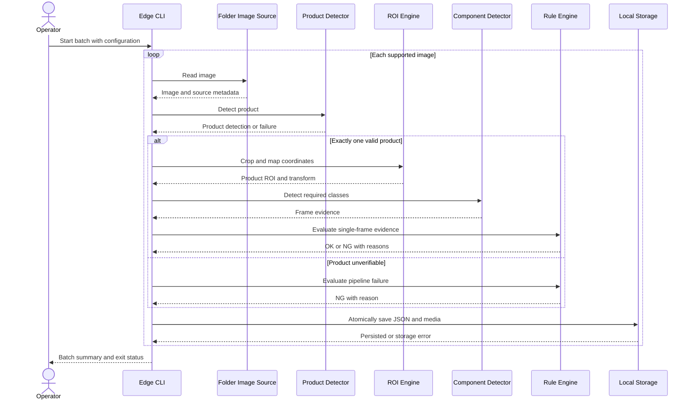

# 6. AI Detection Pipeline

## 6.1 Purpose

This document defines the end-to-end inspection pipeline from an acquired image to a persisted product-level decision. Detailed subsystem behavior is specified in [camera and image acquisition](07-camera-and-image-acquisition.md), [product detection and ROI](08-product-detection-and-roi.md), [component detection](09-component-detection.md), [temporal aggregation](10-temporal-aggregation.md), and the [rule engine](11-rule-engine.md).

The safety invariant is:

> An inspection may be `OK` only when every required component has sufficient valid evidence and every mandatory pipeline stage is verifiable. Missing, uncertain, invalid, or unavailable evidence produces `NG`, never `OK`.

This is a fail-safe classification policy, not a claim of perfect detection accuracy.

## 6.2 Scope by Delivery Phase

| Scope | Included |
|---|---|
| Static train-and-inspect MVP | X-AnyLabeling YOLO labels, product and component model training, folder input, product detection, ROI extraction, component detection, deterministic rules, JSON result, ROI and annotated image, held-out verification |
| One-month production target | Camera capture, barcode resolution, product windows, frame quality, per-component temporal aggregation, local persistence, asynchronous upload |
| Future | Perspective normalization where validated, hardware-trigger/PLC adapters, model ensembles, tracking across complex scenes |

The static MVP deliberately excludes video aggregation, central-server dependency, and automated actuation. Its training CLI is developer-only and never becomes a dependency of the inspection runtime. Production inspection remains entirely executable on the edge computer; server availability cannot block or alter the local decision path.

## 6.3 Pipeline Contracts

All stages exchange typed, immutable records containing `inspection_id`, capture timestamps, coordinate-space identifiers, and version metadata. Coordinates are expressed as pixel-space `xyxy` values with an explicit image width and height. The pipeline records:

- source and frame identity;
- frame quality and rejection reasons;
- barcode and product-type resolution status;
- product detection, ROI transform, and component detections;
- per-component aggregate evidence;
- final decision and reason codes;
- product-model, component-model, product-configuration, and rule versions.

The implementation should use bounded in-process queues between real-time stages. Queue saturation is observable and must discard according to a configured policy without mixing products; an inspection whose required evidence was discarded is `NG` with `INSUFFICIENT_VALID_FRAMES`.

## 6.4 Static-Image Inspection Sequence



Single-frame MVP evidence is not treated as temporal evidence. Each required component must independently pass its configured single-frame threshold.

## 6.5 Real-Time Processing Flow

The real-time pipeline performs these steps for each physical product:

1. Open a product window from an authoritative trigger or validated entry event.
2. Capture frames and reject unusable frames using deterministic quality gates.
3. Resolve the barcode and product type; do not guess an ambiguous mapping.
4. Detect exactly one inspectable product and derive its ROI.
5. Detect components in each valid ROI and retain evidence by component key.
6. Close the window using the configured exit, timeout, or trigger condition.
7. Aggregate evidence independently for each required component.
8. Evaluate the pinned rule and configuration versions.
9. Persist the result and media transactionally before publishing completion.
10. Enqueue uploads independently of inspection execution.

Inference may be batched only when batching remains within the product-window latency budget and preserves frame-to-inspection correlation.

## 6.6 Configuration

```yaml
pipeline:
  max_inflight_inspections: 2
  frame_queue_size: 12
  inspection_timeout_ms: 2500
  minimum_valid_frames: 3
  fail_on_multiple_products: true
  require_barcode: true
  persist_before_complete: true
models:
  product_manifest: /opt/assemblyvision/models/product/manifest.json
  component_manifest: /opt/assemblyvision/models/component/manifest.json
quality:
  min_laplacian_variance: 80.0
  min_mean_brightness: 35.0
  max_mean_brightness: 225.0
```

The `pipeline.*` keys above describe the production windowed pipeline and are
deferred: the M1 static single-frame CLI accepts only `product_detection`,
`component_detection`, `components`, and `roi` sections and rejects unknown
keys (AUDIT-001).

Configuration is schema-validated at startup. Invalid configuration prevents inspection readiness. Active model, rule, and product configuration versions are pinned when a product window opens and cannot change within that window.

## 6.7 Failure Handling

| Failure | Required behavior |
|---|---|
| Image unreadable or camera frame corrupt | Exclude frame; return `NG` if evidence becomes insufficient |
| Barcode absent, ambiguous, or unmapped when required | `NG`; use no inferred product type |
| No product, multiple products, or invalid ROI | `NG`; skip component inference when its input is invalid |
| Model load/inference error | Mark subsystem unhealthy and inspection `NG`; never reuse a previous detection |
| Timeout or queue overflow | Close affected window as `NG`; preserve diagnostics |
| Local result cannot be durably persisted | Do not announce `OK`; raise a blocking local storage fault |
| Server/network unavailable | Continue local inspection and queue upload |

Exceptions are converted at subsystem boundaries into explicit reason codes. Raw exceptions and stack traces belong in structured logs, while inspection records contain stable business reason codes.

## 6.8 Observability

Record stage latency, valid/rejected frame counts, product-detection success, ROI failures, barcode-read success, per-component confidence distributions, decision counts by reason, queue depth, inference device, and active versions. Logs include `inspection_id`, `frame_id`, and `device_id`; they must not contain credentials or unbounded image data.

## 6.9 Verification

- Unit-test stage contracts, threshold boundaries, coordinate transforms, and reason-code mapping.
- Run golden-image tests with expected detections and decisions pinned to model manifests.
- Verify that every injected stage exception produces `NG` or blocks readiness, never `OK`.
- Test mixed product types and version changes at window boundaries.
- Measure average and P95 latency, throughput, NG recall, product-detection success, and per-component recall.
- Reproduce results from persisted input, configuration, and version metadata where deterministic inference support permits.

## 6.10 Open Questions and Validation Required

- Confirm the production latency and throughput budgets after conveyor-speed measurement.
- Select and validate the edge inference hardware and execution provider.
- Confirm whether barcode resolution is mandatory for every product type.
- Determine the approved behavior for multiple products in one frame with customer operations.
- Establish measured acceptance thresholds using production data not used for training.
