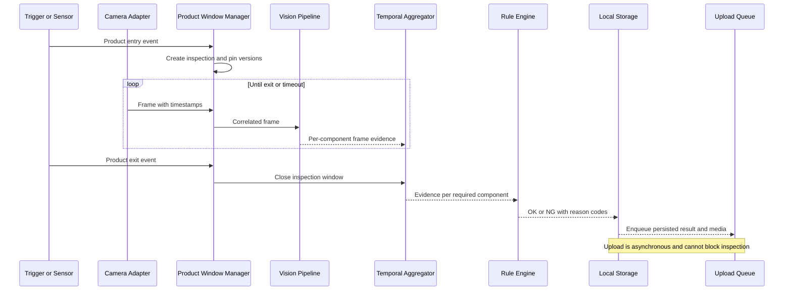

# 7. Camera and Image Acquisition

## 7.1 Purpose and Boundary

The acquisition subsystem owns industrial-camera integration, trigger handling, timestamps, frame buffering, and image-quality metadata. It emits frames; it does not detect products, decide inspection outcomes, or depend on the central server. Downstream processing is defined by the [AI detection pipeline](06-ai-detection-pipeline.md).

## 7.2 Scope by Delivery Phase

| Scope | Acquisition source |
|---|---|
| Static-image MVP | Deterministically ordered files from an input directory |
| Camera mock / simulated | Folder (looped), local video file, OpenCV local/virtual device, remote RTSP stream, or remote HTTP-image polling — all through the same `FrameSource` seam (ADR-013) |
| Production target | GigE Vision / GenICam industrial camera as the primary path, with fixed lighting, reconnect handling, product-window correlation, and optional rolling video; UVC USB remains a compatibility path |
| Future | Additional camera vendors, multiple synchronized cameras, PLC or encoder triggers |

Linux is the primary production runtime. Windows compatibility is supported only
when the selected camera's GenTL producer or UVC driver is available and passes
the same adapter conformance suite; Windows is not assumed to be production
ready before that validation. The camera vendor, SDK/GenTL producer, trigger
electrical interface, exposure, and conveyor speed remain deployment decisions.

The initial target profile is approximately 4 megapixels at 25-30 FPS. It does
not imply that every camera format is accepted: the adapter must explicitly
report supported formats and either convert an approved format deterministically
or fail before inspection. At minimum, the production validation covers the
selected camera's Mono8, Bayer8, RGB8, BGR8, or YUV format as applicable; raw
buffers are never silently reinterpreted.

## 7.3 Adapter Interface

Vendor code is isolated behind a `FrameSource` protocol so recorded data can exercise the same pipeline.

```python
class FrameSource(Protocol):
    def open(self) -> CameraCapabilities: ...
    def configure(self, settings: CameraSettings) -> AppliedSettings: ...
    def frames(self, stop: Event) -> Iterator[CapturedFrame]: ...
    def close(self) -> None: ...
```

`CapturedFrame` includes a process-local monotonic timestamp, wall-clock UTC timestamp, sequence number, dimensions, pixel format, acquisition status, and image buffer. The monotonic clock controls durations; UTC supports traceability. Vendor buffers must be copied or released according to SDK ownership rules before being passed asynchronously.

Implemented sources (ADR-013), all behind this protocol: `folder` (static
image directory, optional loop), `video` (local video file), `opencv-device`
(local camera index or `/dev/videoN`, including virtual cameras such as Linux
`v4l2loopback` or OBS Virtual Camera), `rtsp` (remote RTSP stream via PyAV
with an OpenCV fallback), `http-image` (poll a remote JPEG URL at a
configured interval), and `gige-vision` (GenICam/GenTL via Harvester and a
vendor GenTL producer). Read/decode failures raise a frame-stream error and
are never silently skipped.

The production `gige-vision` source is a GenICam/GenTL consumer behind
the same protocol. It binds a camera by stable serial number rather than an IP
address and records the model, firmware, GenTL producer, network interface,
pixel format, and applied acquisition settings. It supports continuous,
software-triggered, and hardware-triggered acquisition; hardware trigger is
preferred for a production product boundary. Configured pixel format, exposure,
gain, and packet size are applied to the GenICam node map and verified by
read-back; only the supported formats (`Mono8`, `RGB8`, `BGR8`) convert
deterministically to RGB and anything else fails before inspection (fail-safe).
The GenTL bindings ship only manylinux and Windows wheels, so the GigE Vision
path is Linux/Windows-only; macOS resolves the extra to nothing. PTP is not
required for the initial deployment: process-monotonic time controls windows
and UTC remains traceability metadata. PTP may be enabled later only after a
site requirement and validation.

Static files receive stable IDs derived from relative path plus content checksum. Unsupported, partially written, or undecodable files are recorded as failed inputs rather than silently skipped.

## 7.4 Trigger and Product-Window Strategy

Preferred production ordering is:

1. Hardware photoelectric or PLC trigger, because it provides the clearest physical-product boundary.
2. Barcode event associated through a bounded time window, if barcode timing is reliable.
3. Vision entry/exit zones with tracking, after validation against adjacent products.
4. Time-only windows as a controlled fallback, because changing conveyor speed can mix products.

Debounce triggers and assign a unique `inspection_id` immediately. Duplicate triggers within the configured dead time are logged and suppressed only when the physical process validates that policy. Overlapping windows are rejected or supported explicitly; they must never share mutable evidence.

## 7.5 Real-Time Inspection Sequence



Each instance independently exposes its latest captured frame as a
rate-limited JPEG preview (`GET /api/v1/camera/{instance_id}/preview`,
ADR-013). The preview is a REST stopgap for the dashboard until the WebSocket
runtime channel supersedes it; preview loss never changes the inspection
engine state.

## 7.6 Frame Quality and Color Handling

Decode into a documented canonical format, normally BGR8 for OpenCV, while preserving original dimensions. Model preprocessing performs its own RGB conversion. Quality checks should include blur, brightness range, corruption, frame age, and optionally saturation or glare. Thresholds are camera-specific and must be calibrated from production captures.

A rejected frame remains traceable with rejection reasons but contributes no positive component evidence. If too few valid frames remain, the product is `NG`; unusable input cannot become `OK` through absence of contradictory evidence.

## 7.7 Configuration

One edge host runs one or more independent inspection instances, each with
its own camera source and its own models/rule/product (ADR-013). Configuration
lives under the `instances:` list in the shared pipeline configuration:

```yaml
instances:
  - instance_id: line-1
    device_id: null                 # default = uuid5(namespace, instance_id)
    camera:
      source: rtsp
      url: rtsp://192.168.1.10/stream
      fps: null
      reconnect:
        initial_delay_ms: 250
        maximum_delay_ms: 10000
    inspection:
      enabled: false                # preview-only until the window milestone
    # models, product_detection, component_detection, roi, rule per instance
  - instance_id: line-2
    camera:
      source: video
      path: /data/line2.mp4
      fps: 25
  - instance_id: bench
    camera:
      source: folder
      path: /data/images
      loop: true
      fps: 5
  - instance_id: webcam-0
    camera:
      source: opencv-device
      device: 0
```

Source-specific requirements:

| Source | Required field | Notes |
|---|---|---|
| `folder` | `path` | Deterministic sorted order; `loop` re-walks the directory |
| `video` | `path` | Decoded with OpenCV; `fps` paces emission |
| `opencv-device` | `device` (index or `/dev/videoN`) | Virtual cameras are plain devices here |
| `rtsp` | `url` | PyAV primary, OpenCV fallback; bounded reconnect |
| `http-image` | `url` | Polled at `fps`/interval with a bounded HTTP timeout |
| `gige-vision` | `serial` | GenICam/GenTL via Harvester + vendor `.cti`; continuous, software, or hardware trigger; `gentl_producer` deployment-provided |

`null` exposure and gain mean site calibration is required, not an automatic default. Applied camera settings and serial number are recorded at startup and on change.

GigE packet size is negotiated only when both the camera and selected network
interface support it. Jumbo frames are an optional optimization, not a
requirement: the deployment validates NIC MTU, switch path, packet loss, and
camera packet size before applying a value. A path that does not support jumbo
frames remains valid at standard MTU if it meets the measured frame-loss and
latency budget.

USB UVC cameras use `opencv-device` and are appropriate for compatibility,
development, and any validated low-risk deployment. USB3 Vision cameras that
expose GenICam use the `gige-vision`/GenTL-style adapter rather than being
silently downgraded to OpenCV. Phone cameras and low-cost Ethernet cameras are
not classified by price or connector: a phone may be used through a validated
UVC, RTSP, or HTTP source for development, while an Ethernet camera must prove
GigE Vision / GenICam support before it can use the production adapter. A
camera exposing only RTSP/ONVIF remains an RTSP compatibility source and does
not gain industrial trigger guarantees.

## 7.8 Recovery and Failure Handling

- On disconnect, stop accepting new inspections, close any active window as `NG` with `CAMERA_DISCONNECTED`, and reconnect with bounded exponential backoff.
- On sequence gaps or buffer overflow, increment metrics and mark affected windows as degraded; insufficient evidence yields `NG`.
- On stale or repeated frames, reject the frames and report camera health degradation.
- On clock adjustment, continue duration calculations with the monotonic clock and record the wall-clock discontinuity.
- On capture-process restart, do not resume an ambiguous open window as though complete; persist it as interrupted `NG`.
- On server outage, make no acquisition change. Local capture and inspection continue while storage capacity permits.

Rolling video writes segmented files to limit corruption after power loss. Media persistence and deletion rules are defined in [local storage and retention](12-local-storage-and-retention.md).

## 7.9 Verification

- Contract-test each vendor adapter against recorded and simulated SDK behavior.
- Test disconnect, reconnect, dropped frames, duplicate sequence numbers, corrupt buffers, and delayed frames.
- Verify trigger debounce, adjacent products, timeout, and restart at every window phase.
- Calibrate quality thresholds with normal, blurred, dark, bright, reflective, and empty production scenes.
- Soak-test capture longer than a normal production shift while monitoring memory and buffer growth.
- Verify that file-source ordering and output IDs are repeatable.

## 7.10 Open Questions and Validation Required

- Select the camera vendor, model, SDK, lens, interface, and supported operating system.
- Measure frame rate, exposure, conveyor speed, trigger timing, and maximum product-window overlap.
- Confirm whether a hardware trigger, PLC signal, photoelectric sensor, or vision-only trigger is available.
- Validate lighting stability, glare, motion blur, and acceptable camera-shift tolerances.
- Confirm the barcode reader topology and timing relative to image capture.
