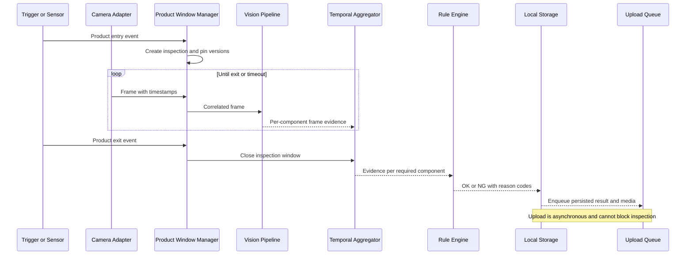

# 7. Camera and Image Acquisition

## 7.1 Purpose and Boundary

The acquisition subsystem owns industrial-camera integration, trigger handling, timestamps, frame buffering, and image-quality metadata. It emits frames; it does not detect products, decide inspection outcomes, or depend on the central server. Downstream processing is defined by the [AI detection pipeline](06-ai-detection-pipeline.md).

## 7.2 Scope by Delivery Phase

| Scope | Acquisition source |
|---|---|
| Static-image MVP | Deterministically ordered files from an input directory |
| Production target | One fixed industrial camera with fixed lighting, reconnect handling, product-window correlation, optional rolling video |
| Future | Additional camera vendors, multiple synchronized cameras, PLC or encoder triggers |

The camera vendor, SDK, operating system, trigger electrical interface, frame rate, exposure, and conveyor speed remain deployment decisions.

## 7.3 Adapter Interface

Vendor code is isolated behind a `FrameSource` protocol so recorded data can exercise the same pipeline.

```python
class FrameSource(Protocol):
    def open(self) -> CameraCapabilities: ...
    def configure(self, settings: CameraSettings) -> AppliedSettings: ...
    def frames(self, stop: Event) -> Iterator[CapturedFrame]: ...
    def close(self) -> None: ...
```

`CapturedFrame` includes a process-local monotonic timestamp, wall-clock UTC timestamp, sequence number, dimensions, pixel format, acquisition status, and image buffer. The monotonic clock controls durations; UTC supports traceability. Vendor buffers must be copied or released according to SDK ownership rules before being passed asynchronously.

Static files receive stable IDs derived from relative path plus content checksum. Unsupported, partially written, or undecodable files are recorded as failed inputs rather than silently skipped.

## 7.4 Trigger and Product-Window Strategy

Preferred production ordering is:

1. Hardware photoelectric or PLC trigger, because it provides the clearest physical-product boundary.
2. Barcode event associated through a bounded time window, if barcode timing is reliable.
3. Vision entry/exit zones with tracking, after validation against adjacent products.
4. Time-only windows as a controlled fallback, because changing conveyor speed can mix products.

Debounce triggers and assign a unique `inspection_id` immediately. Duplicate triggers within the configured dead time are logged and suppressed only when the physical process validates that policy. Overlapping windows are rejected or supported explicitly; they must never share mutable evidence.

## 7.5 Real-Time Inspection Sequence



## 7.6 Frame Quality and Color Handling

Decode into a documented canonical format, normally BGR8 for OpenCV, while preserving original dimensions. Model preprocessing performs its own RGB conversion. Quality checks should include blur, brightness range, corruption, frame age, and optionally saturation or glare. Thresholds are camera-specific and must be calibrated from production captures.

A rejected frame remains traceable with rejection reasons but contributes no positive component evidence. If too few valid frames remain, the product is `NG`; unusable input cannot become `OK` through absence of contradictory evidence.

## 7.7 Configuration

```yaml
camera:
  adapter: vendor_adapter_name
  device_serial: configured-at-site
  pixel_format: BGR8
  acquisition_mode: continuous
  trigger_mode: hardware
  exposure_us: null
  gain_db: null
  reconnect:
    initial_delay_ms: 250
    maximum_delay_ms: 10000
capture:
  buffer_frames: 32
  stale_frame_ms: 250
  trigger_debounce_ms: 100
  rolling_video_seconds: 30
```

`null` exposure and gain mean site calibration is required, not an automatic default. Applied camera settings and serial number are recorded at startup and on change.

## 7.8 Recovery and Failure Handling

- On disconnect, stop accepting new inspections, close any active window as `NG` with `CAMERA_DISCONNECTED`, and reconnect with bounded exponential backoff.
- On sequence gaps or buffer overflow, increment metrics and mark affected windows as degraded; insufficient evidence yields `NG`.
- On stale or repeated frames, reject the frames and report camera health degradation.
- On clock adjustment, continue duration calculations with the monotonic clock and record the wall-clock discontinuity.
- On capture-process restart, do not resume an ambiguous open window as though complete; persist it as interrupted `NG`.
- On server outage, make no acquisition change. Local capture and inspection continue while storage capacity permits.

Rolling video writes segmented files to limit corruption after power loss. Media persistence and deletion rules are defined in [local storage and retention](12-local-storage-and-retention.md).

## 7.9 Verification

- Contract-test each vendor adapter against recorded and simulated SDK behavior.
- Test disconnect, reconnect, dropped frames, duplicate sequence numbers, corrupt buffers, and delayed frames.
- Verify trigger debounce, adjacent products, timeout, and restart at every window phase.
- Calibrate quality thresholds with normal, blurred, dark, bright, reflective, and empty production scenes.
- Soak-test capture longer than a normal production shift while monitoring memory and buffer growth.
- Verify that file-source ordering and output IDs are repeatable.

## 7.10 Open Questions and Validation Required

- Select the camera vendor, model, SDK, lens, interface, and supported operating system.
- Measure frame rate, exposure, conveyor speed, trigger timing, and maximum product-window overlap.
- Confirm whether a hardware trigger, PLC signal, photoelectric sensor, or vision-only trigger is available.
- Validate lighting stability, glare, motion blur, and acceptable camera-shift tolerances.
- Confirm the barcode reader topology and timing relative to image capture.
