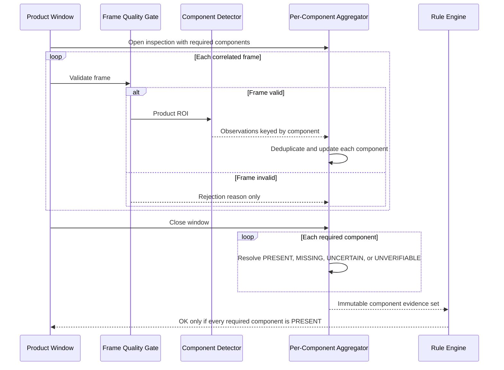

# 10. Temporal Aggregation

## 10.1 Purpose

The temporal aggregator converts frame-level observations from [component detection](09-component-detection.md) into product-level evidence for the [rule engine](11-rule-engine.md). YOLO still processes individual frames. Aggregation improves system robustness by combining observations; it does not increase the model's single-frame accuracy.

## 10.2 Scope

Temporal aggregation is excluded from the static train-and-inspect MVP. The production target aggregates evidence within one bounded physical-product window. Future tracking may support more complex overlapping scenes, but evidence isolation remains mandatory.

## 10.3 Core Invariants

1. Evidence is partitioned by `inspection_id`, required component key, and pinned model/configuration versions.
2. Each required component is aggregated independently; whole-product majority voting is prohibited.
3. Rejected, stale, duplicate, or wrong-window frames do not contribute.
4. One high-confidence observation or multiple medium-confidence observations may establish presence only according to that component's configured policy.
5. Uncertain, contradictory, or insufficient evidence cannot become `OK`.
6. Closing a window is final; late frames are recorded as dropped and never mutate its decision.

## 10.4 Component State Model

Each required component ends in one of these evidence states:

| State | Meaning | Rule-engine consequence |
|---|---|---|
| `PRESENT` | Configured positive-evidence policy satisfied | Eligible to satisfy that component |
| `MISSING` | Enough valid opportunities existed but no acceptable positive evidence | `NG` |
| `UNCERTAIN` | Some evidence exists but quality, consistency, or amount is insufficient | `NG` |
| `UNVERIFIABLE` | Pipeline/window could not provide valid inspection opportunity | `NG` |

`UNCERTAIN` and `UNVERIFIABLE` are retained diagnostically even if the external business interface exposes only `OK` and `NG`.

## 10.5 Temporal Aggregation Sequence



## 10.6 Default Policy

A practical initial policy accepts either one high-confidence observation or at least two medium-confidence observations in distinct adjacent valid frames. It also requires enough valid inspection opportunities and optional visibility constraints.

```python
def resolve(evidence, policy):
    valid = deduplicate(e for e in evidence if e.frame_quality.accepted)
    if len(valid.opportunities) < policy.minimum_valid_frames:
        return UNVERIFIABLE
    if any(e.confidence >= policy.high_confidence for e in valid.detections):
        return PRESENT
    medium = [e for e in valid.detections if e.confidence >= policy.medium_confidence]
    if has_adjacent_distinct_frames(medium, policy.max_frame_gap) and len(medium) >= policy.medium_hits:
        return PRESENT
    if medium or valid.low_confidence_detections:
        return UNCERTAIN
    return MISSING
```

Frame adjacency uses capture sequence and a maximum elapsed-time bound. Multiple boxes in one frame count as one temporal hit unless the rule is explicitly count-based.

## 10.7 Configuration

```yaml
temporal:
  minimum_valid_frames: 3
  maximum_window_ms: 2500
  reject_duplicate_frame_ids: true
  components:
    manual:
      high_confidence: 0.85
      medium_confidence: 0.65
      medium_hits: 2
      require_adjacent_hits: true
      max_frame_gap: 1
    component_a:
      high_confidence: 0.90
      medium_confidence: 0.70
      medium_hits: 2
      require_adjacent_hits: true
      max_frame_gap: 1
```

Policies are versioned and validated per model and product type. Configured thresholds must obey `observation_threshold <= medium_confidence < high_confidence`.

## 10.8 Window Integrity and Failure Handling

- A trigger timeout closes the window as incomplete; unresolved components become `UNVERIFIABLE`.
- Duplicate frame IDs are ignored and counted.
- Frames outside the window or with mismatched inspection IDs are quarantined from evidence.
- Multiple products or identity switches invalidate the window unless a validated tracker proves continuity.
- Worker restart closes recovered open windows as interrupted `NG`; it does not reconstruct evidence from partial memory unless all state was durably journaled.
- Queue loss or inference errors reduce valid opportunities and can only move evidence toward `UNCERTAIN` or `UNVERIFIABLE`.
- Early `OK` finalization is disabled by default because later frames may reveal ambiguity; optional early completion requires production validation and still must satisfy every component.

## 10.9 Persistence and Observability

Persist frame opportunities, accepted/rejected status, observations, deduplication decisions, final component states, thresholds, hit frame IDs, confidence summary, and close reason. Metrics include windows opened/closed/timed out, frame mixing attempts, per-component state counts, valid frames per window, and aggregation latency.

## 10.10 Verification

- Table-test threshold equality, one high hit, repeated same-frame hits, adjacent/non-adjacent medium hits, no hits, and low-confidence-only evidence.
- Property-test that adding invalid evidence cannot change a component to `PRESENT`.
- Property-test that evidence for component A cannot change component B.
- Test late frames, duplicate IDs, timeout, restart, version changes, and mixed inspection IDs.
- Replay recorded production windows and compare per-component outcomes deterministically.
- Validate policies using product-level NG recall and per-component recall, not frame-level accuracy alone.

## 10.11 Open Questions and Validation Required

- Select the authoritative product-window mechanism and prove frame-to-product isolation.
- Measure typical and worst-case valid frame counts and inter-frame timing.
- Calibrate component-specific high/medium thresholds and adjacency requirements.
- Determine whether any component needs count, visibility, or spatial-consistency aggregation.
- Decide whether durable mid-window journaling is justified by window duration and power-loss risk.
