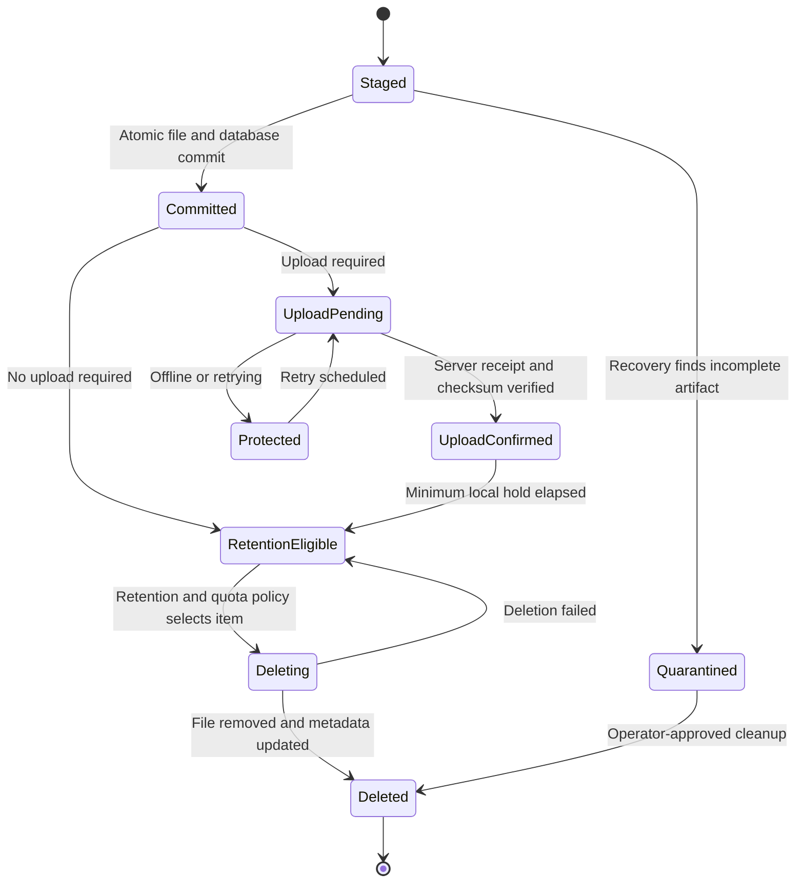

# 12. Local Storage and Retention

## 12.1 Purpose

The edge client durably stores inspections, evidence metadata, media references, configuration versions, and the persistent upload queue. Storage supports continued inspection during network or central-server outages. Upload behavior is defined in [upload and synchronization](13-upload-and-synchronization.md).

## 12.2 Scope

| Scope | Storage behavior |
|---|---|
| Static-image MVP | JSON result, product ROI, annotated image, deterministic output paths |
| Production target | SQLite metadata, filesystem media, transactional outbox, power-loss recovery, disk monitoring, retention |
| Future | PostgreSQL for unusually large edge installations and S3-compatible local media abstraction |

Runtime data is stored in explicit persistent volumes outside the Git repository and container writable layer.

## 12.3 Storage Layout and Ownership

SQLite initially stores relational metadata; media remains on the filesystem to avoid database bloat. Suggested layout:

```text
/var/lib/assemblyvision/
├── db/edge.sqlite3
├── media/staging/
├── media/inspections/YYYY/MM/DD/<inspection_id>/
├── video/segments/YYYY/MM/DD/
├── models/
├── rules/
└── quarantine/
```

Database rows use UUID/ULID inspection identifiers and UTC timestamps. Media records include relative path, media type, byte size, SHA-256 checksum, creation time, upload requirement/status, and deletion state. Paths are generated by trusted code and cannot contain barcode text or caller-supplied traversal segments.

## 12.4 Atomic Persistence

The result must be durable before the system publishes completion or `OK` to operational consumers:

1. Write each media file to `staging`, flush it, and atomically rename it to its final path.
2. Begin one database transaction.
3. Insert inspection, frame/component evidence summaries, and media rows.
4. Insert upload tasks in the same transaction as a transactional outbox.
5. Commit; optionally checkpoint according to the configured SQLite mode.
6. Publish the local completion event.

If media succeeds but the transaction fails, recovery finds and quarantines unreferenced files. If the database commits but a required media rename is absent, integrity scanning marks the inspection/media fault and prevents false claims of complete evidence.

SQLite uses WAL mode, foreign keys, busy timeout, and a single controlled writer where practical. Backups use the SQLite backup API, not a raw copy of a live database.

## 12.5 Media Policy

| Artifact | Default production intent |
|---|---|
| Raw full video | Optional rolling segmented buffer; local only unless selected |
| OK key frame | Retain locally and upload one representative frame |
| NG key frames | Retain multiple frames and upload according to policy |
| NG clip | Optional short event clip; retain until upload and policy expiry |
| Product ROI | Retain for NG; OK retention configurable |
| Annotated image | Derived evidence; retain for NG and optionally OK samples |
| Logs | Size/time-rotated with protected error windows |
| Database records | Longer-lived than bulk media where capacity permits |

Exact periods and quotas are deployment configuration, not architectural constants.

## 12.6 Data-Retention Lifecycle



## 12.7 Retention and Disk Pressure

Cleanup runs asynchronously under an inter-process lease. It selects only committed artifacts whose minimum retention has elapsed and whose required upload has a verified receipt. Database references are locked/marked `DELETING` before unlinking; successful deletion updates metadata. Failed deletion is retryable and observable.

Use configurable warning, critical, and stop thresholds. At warning, accelerate eligible cleanup and alert. At critical, stop optional full-video/OK-media capture and preserve metadata plus NG evidence. At stop, if a complete auditable inspection cannot be persisted, stop accepting new products rather than returning unrecorded `OK`. Never delete pending-upload NG evidence merely to continue silently.

Example policy:

```yaml
storage:
  warning_free_percent: 20
  critical_free_percent: 10
  stop_free_percent: 5
  protect_pending_uploads: true
retention:
  ok_media_days: null
  ng_media_days: null
  rolling_video_hours: null
  logs_days: null
  metadata_days: null
```

`null` values intentionally require customer approval before production activation.

## 12.8 Recovery and Integrity

At startup, run migrations, database integrity checks appropriate to startup latency, staging reconciliation, missing-file detection, and outbox recovery. Open inspections from a prior process are closed as interrupted `NG`. Upload tasks in `IN_PROGRESS` return to pending after lease expiry. Periodic sampling recomputes media checksums; a mismatch quarantines the artifact and raises an event.

Database corruption puts the service into storage-not-ready mode. Restore from a validated backup or documented recovery copy; do not initialize a fresh database over corrupted evidence automatically.

## 12.9 Verification

- Kill the process at every atomic-persistence step and verify deterministic recovery.
- Test power loss, disk full, read-only filesystem, SQLite lock/busy, corrupt database, missing media, and checksum mismatch.
- Verify cleanup never selects pending/in-progress uploads or unexpired protected artifacts.
- Test threshold transitions and that storage stop mode cannot report `OK`.
- Test backup and restore with media/reference reconciliation.
- Soak-test concurrent inspection, upload, retention, and dashboard reads.

## 12.10 Open Questions and Validation Required

- Agree exact retention periods and quotas for each media type, logs, and metadata.
- Measure daily inspection volume, frame sizes, clip sizes, and outage duration to size the disk.
- Confirm whether full or rolling video is legally and operationally required.
- Define encryption-at-rest, backup, and secure-deletion requirements.
- Confirm acceptable behavior when disk capacity reaches the protected-data stop threshold.

## 12.11 Implementation Status (E2)

The retention and disk-safety milestone is implemented in `assemblyvision_edge`
(see [the E2 delivery task](../tasks/E2-retention-and-disk-safety.md)):

- **Durable retention state (E2a)**: migration 0007 adds media `created_at`,
  `retention_eligible_at`, hold state, deletion claim/lease/fencing columns,
  purge timestamp/reason, delete error, and integrity status. Media rows record
  their hold deadline at enqueue from the approved policy; rows without a
  deadline are never eligible. A `PURGED` row remains an audit tombstone.
- **Receipt-gated eligibility and fencing**: an artifact is eligible only when
  its inspection is `SYNCED` (every task receipt-verified) with a media receipt
  that includes the central object identifier, the hold deadline elapsed, and
  no hold/fault/purge/deleting state. The claim transaction releases expired
  leases, re-checks eligibility, and issues a per-artifact fencing token;
  purge/failure/fault transitions require the token and an unexpired lease.
- **Cleanup worker (E2b)**: `RetentionCleanupWorker` claims candidates under the
  inter-process lease, revalidates the trusted bundle path, unlinks, verifies
  absence, and finalizes the tombstone. Missing files become integrity faults,
  never false purges; unlink failures are retryable and observable. Without an
  approved, enabled policy the worker never touches the filesystem.
- **Disk pressure and fail-safe runtime (E2c)**: `StorageSettings`
  (`AV_EDGE_STORAGE_*`, strictly ordered stop < critical < warning) drives
  free-byte and free-inode pressure modes. Device status exposes the mode,
  thresholds, cleanup health/metrics, and stable alerts (`DISK_WARNING`,
  `DISK_CRITICAL`, `DISK_STOP`, `STORAGE_WRITE_FAULT`, `CLEANUP_FAULT`). At
  stop pressure or on a write fault the runtime stops accepting new products and
  reports `inspection_ready=false`; it never returns an unrecorded `OK`. The
  dashboard renders server-authoritative state instead of a fixed threshold.
- **Startup integrity (E2d)**: `scan_storage_integrity` verifies projected
  media existence, size, and checksums by default; deployments may explicitly
  configure bounded deterministic checksum sampling and its coverage is exposed
  through device status. Faults are marked durably;
  malformed/unsafe/conflicting bundles are moved to `quarantine/`, never
  re-imported or deleted; `PRAGMA quick_check` runs at every open and fails
  closed on corruption; abandoned cleanup claims are recovered at startup.

Customer/site retention durations, disk sizing, holds, and stop-mode line
behavior remain release blockers for enabling deletion in production
(E2 task section 4).
