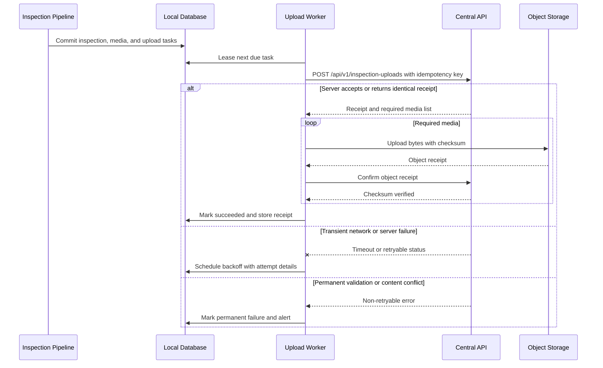
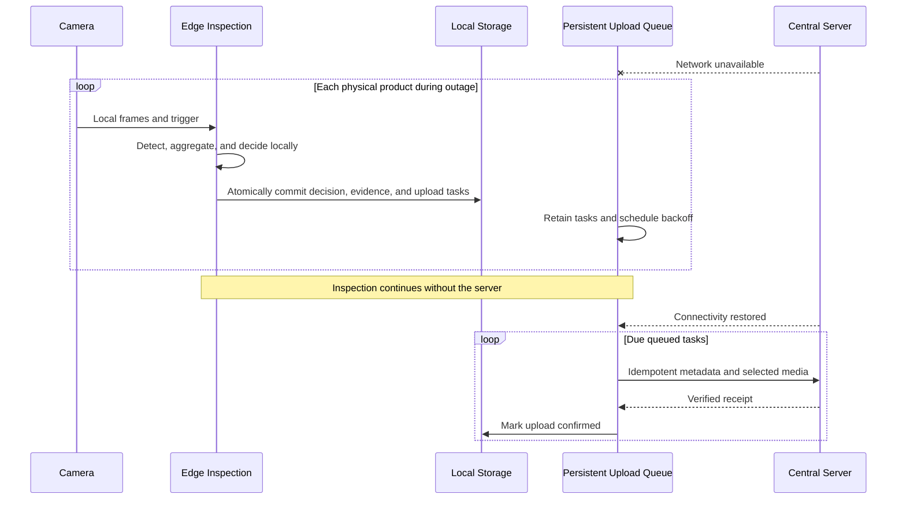

# 13. Upload and Synchronization

## 13.1 Purpose and Boundary

The upload subsystem asynchronously synchronizes locally persisted inspection records and selected media to the central server. It consumes the transactional outbox defined in [local storage and retention](12-local-storage-and-retention.md). It never participates in image inference or local rule evaluation, and server unavailability must not stop inspection while local protected storage remains available.

## 13.2 Upload Scope

For `OK`, upload inspection metadata, barcode, product type, decision, component/confidence summary, versions, device/timestamp, and one representative key frame. For `NG`, upload full metadata, missing/uncertain components, multiple key frames, annotated image, product ROI, optional event clip, and relevant diagnostics. For system exceptions, upload exception type, device/camera state, relevant media/log excerpt, and timestamp.

Do not upload every video frame. Media selection occurs locally and is recorded in the inspection manifest.

## 13.3 Task and Protocol Design

One inspection has a stable client-generated `inspection_id` and manifest checksum. Each upload task has a stable `upload_task_id`, device ID, nullable inspection ID, artifact identity, payload hash, SHA-256 checksum where applicable, byte size, attempt count, next-attempt time, timestamps, lease, and state. Canonical states are `PENDING`, `IN_PROGRESS`, `RETRY_WAIT`, `SUCCEEDED`, `PERMANENT_FAILURE`, and `CANCELLED`.

Metadata ingestion uses the stable idempotency key `inspection:{device_id}:{inspection_id}`. Schema and manifest versions remain inside the hashed payload rather than changing the key. The central server enforces uniqueness on `(device_id, inspection_id)` and `(device_id, idempotency_key)`, stores the receipt atomically with accepted metadata, and returns it for an identical replay. A replay with different immutable content returns a conflict and is quarantined rather than overwritten.

Large media should use resumable or pre-signed object uploads when justified. Completion is accepted only after the server confirms expected size/checksum and binds the object to the inspection.

## 13.4 Upload and Retry Sequence



## 13.5 Retry Policy

Retry connection failures, timeouts, HTTP `408`, `429`, and `5xx`, honoring `Retry-After` within configured bounds. Do not automatically retry authentication/authorization failures, schema incompatibility, checksum conflict, or invalid content indefinitely. Use exponential backoff with full jitter:

```text
delay = random(0, min(max_delay, base_delay * 2 ** min(attempt, exponent_cap)))
```

Worker concurrency and bandwidth are bounded so uploads cannot starve inference or fill memory. Leases recover tasks after worker crashes. A circuit breaker reduces repeated traffic during an outage but periodically probes recovery.

## 13.6 Offline Operation Sequence



Offline duration is limited by local protected-storage capacity, not by a software dependency on the server. If capacity reaches the stop threshold, the edge must stop accepting inspections rather than delete protected evidence or emit unauditable `OK` decisions.

## 13.7 Ordering and Synchronization

The server must not require global chronological arrival. Devices can upload late and out of order. Device UTC timestamps are retained with clock-health metadata; server receive time is separate. Metadata precedes media binding, but inspections can be centrally visible while required media has lifecycle `PENDING`; verified media becomes `AVAILABLE`, terminal failures become `FAILED`, and retention cleanup records `PURGED`.

Configuration/model distribution is a separate pull/download workflow. Upload acknowledgment cannot activate new rules or models, and central data never retroactively changes the immutable local decision. Manual review creates an additional central record rather than rewriting original evidence.

## 13.8 Security and Configuration

Use TLS with per-device credentials and least-privilege scopes. Credentials are provisioned outside images, rotatable, and never logged. Validate server identity, response size, content type, and timeouts.

```yaml
upload:
  base_url: https://central.example.invalid/api/v1
  connect_timeout_seconds: 5
  request_timeout_seconds: 30
  worker_concurrency: 2
  base_retry_seconds: 2
  maximum_retry_seconds: 900
  exponent_cap: 8
  task_lease_seconds: 120
  maximum_bandwidth_mbps: null
  media_chunk_bytes: 8388608
```

The placeholder URL and `null` bandwidth require site configuration.

## 13.9 Failure Handling and Operations

| Failure | Behavior |
|---|---|
| DNS/network/server outage | Persist and retry; local inspection continues |
| Timeout after server commit | Replay same idempotency key; server returns same receipt |
| Worker crash | Lease expires and task becomes eligible |
| HTTP 401/403 | Pause affected tasks, alert credential fault, do not hot-loop |
| HTTP 409 content mismatch | Permanent failure/quarantine; preserve local evidence |
| Checksum mismatch | Re-read local file, retry if locally valid; quarantine if local corruption |
| Local file missing | Permanent media failure, alert, retain inspection metadata |
| Queue backlog growth | Alert by age/count/bytes; protect inference resources |

Expose queue count and bytes by state, oldest pending age, attempt rate, success/failure rate, upload latency, throughput, circuit state, and last successful contact. Manual retry resets only eligible tasks and preserves attempt history.

## 13.10 Verification

- Integration-test idempotent replay after timeout at every server commit boundary.
- Test duplicate task delivery, out-of-order inspections, duplicate media, and conflicting checksums.
- Fault-inject DNS failure, connection reset, slow response, `429`, `5xx`, `401`, `409`, and worker termination.
- Run a prolonged offline test, continue inspections, restart the edge, restore network, and verify complete drain without duplicates.
- Verify upload load cannot breach inspection latency/resource limits.
- Verify retention does not delete required artifacts before a verified receipt.
- Contract-test client/server schema compatibility and unsupported-version handling.

## 13.11 Open Questions and Validation Required

- Confirm the central-server location, API ownership, authentication method, and certificate provisioning process.
- Define maximum expected outage duration and backlog to size local storage and server ingest capacity.
- Agree which media are mandatory by outcome and which may be sampled.
- Select direct API upload versus pre-signed S3-compatible multipart upload after file-size measurement.
- Define bandwidth limits, upload scheduling windows, and customer network proxy/firewall requirements.
- Define operational ownership and resolution targets for permanent upload failures.

## 13.12 Implementation Status (edge outbox and scheduler milestone)

The persistent upload outbox and its worker are implemented in
`assemblyvision_edge`:

- **Atomic projection and outbox**: `persist_inspection_and_enqueue_uploads`
  inserts the immutable projection, media, evidence, and one `INSPECTION` task
  plus one `MEDIA` task per artifact in a single SQLite transaction, so a crash
  cannot leave a completed inspection without its required upload tasks
  (design 12.4 step 3+4). Startup reconciliation applies the same operation to
  every valid bundle, repairing stranded `LOCAL_ONLY` records instead of
  skipping them.
- **Ordered, leased worker**: `UploadScheduler` claims due tasks in an
  immediate transaction; `MEDIA` tasks become due only after their inspection
  task holds a verified success receipt, so metadata always precedes media.
  Each claim carries a per-task fencing token (`lease_owner`), and stale
  `IN_PROGRESS` tasks are reclaimed after lease expiry; every terminal or retry
  update requires the matching token, so a late worker cannot overwrite a
  newer holder.
- **Failure classification** (design 13.9): transport errors and
  `408/429/5xx` schedule exponential backoff with full jitter, honoring a
  numeric `Retry-After` measured from the response time; missing/corrupt local
  evidence (`MEDIA_EVIDENCE_MISSING`, `MEDIA_CHECKSUM_MISMATCH`,
  `INSPECTION_EVIDENCE_MISSING`) and server conflicts (`409`) become permanent
  failures while local evidence is preserved.
- **Verified receipts**: a 2xx is only success when the bounded typed receipt
  echoes the idempotency key, object, kind, byte size, and checksum of the
  payload actually sent; media receipts additionally require a central object
  identifier. Verified receipts and central object identifiers are persisted.
  Inspection synchronization is recomputed from all required tasks:
  `QUEUED` while outstanding, `PARTIAL` after metadata with pending media,
  `SYNCED` only when every required task has a verified receipt, and `FAILED`
  on any permanent failure.
- **Sinks and configuration**: `DirectoryUploadSink` (local/development and
  tests, idempotent by key) and `HttpUploadSink` (HTTPS POST to
  `{base_url}/inspection-uploads` with the idempotency key and payload). The
  worker is enabled through the supported `serve` path via `UploadSettings`
  and `AV_EDGE_UPLOAD_*` environment variables (endpoint or local sink,
  separate `AV_EDGE_UPLOAD_TOKEN` credential, timeouts, retry/lease/batch
  tunables, bandwidth bound). Central endpoints require HTTPS; explicit
  development HTTP is restricted to loopback. Without a configured destination
  the worker stays explicitly disabled and tasks remain visible in the uploads
  API.
- **Contract 06 coverage**: tests cover successful upload, network
  interruption, retry/backoff, `Retry-After` timing, duplicate enqueue, process
  restart with lease reclamation and fencing, missing file, checksum mismatch,
  server idempotency conflict, receipt validation, ordered metadata-before-media
  drain, synchronization states, and duplicate-free drain.
- **Observability (E1)**: the uploads API reports task states; device status
  exposes persistent queue facts (pending count/bytes, oldest pending age) from
  the repository plus process-local worker liveness (attempt/success/failure
  counters, failure rate, last attempt/success, last error) from the scheduler,
  with `UPLOAD_BLOCKED` (queued work but no worker) and `UPLOAD_FAILING`
  (retryable backlog or attempts without any success while work is pending)
  alerts. Task payload sizes are recorded at enqueue so queue bytes need no
  media reads.

Remaining for the connected pilot: the central ingestion endpoint and its
server-side receipt contract, media binding confirmations, and retention
gating on verified receipts.

## 13.13 Implementation Status (upload resilience, E3)

The upload-resilience milestone adds outage behavior on top of the outbox
scheduler (design 13.5/13.9, E3 task):

- **Bandwidth throttling**: a token-bucket limiter bounds network payload
  bytes per second from `UploadSettings.maximum_bandwidth_mbps` (`None`
  disables throttling); burst is capped at one second of tokens and the
  limiter never gates local persistence. Cumulative bytes sent and the
  configured ceiling are exposed through scheduler health and device status.
- **Circuit breaker**: consecutive retryable failures
  (`circuit_failure_threshold`) open the circuit; while open the scheduler
  claims nothing, and after `circuit_open_seconds` a single half-open probe
  judges recovery — success closes the circuit, failure reopens it.
  Permanent failures never count toward the circuit. Circuit state and last
  change are exposed with a stable `UPLOAD_CIRCUIT_OPEN` alert; the durable
  queue is never mutated by the circuit.
- **Controlled manual retry**: `POST /api/v1/uploads/{upload_task_id}/retry`
  resets only `RETRY_WAIT` / `PERMANENT_FAILURE` tasks to `PENDING` with
  `attempt_count + 1`; unknown tasks are 404 and non-eligible tasks are 409
  without mutation.
- **Long-outage drain**: fault-injection tests run days of offline
  inspection, a process restart, and a restore that drains the whole queue
  duplicate-free with ordered metadata-before-media uploads.

## 13.14 Resumable Large-Media Client Contract (E3e)

Large media (NG clips, full video segments) may exceed a single upload
envelope. The edge-side boundary and the central protocol contract are
defined here; the central endpoint is not implemented and chunked transfer
starts only after the Edge-to-central contract freezes:

- Each media upload task keeps its stable `upload_task_id` and idempotency
  key; retries of any chunk or of the whole object reuse the same key, so
  the central server can deduplicate every chunk and completion.
- Transfer is chunked with a configured `media_chunk_bytes` ceiling
  (`UploadSettings.media_chunk_bytes`, default 8 MiB, reserved until the
  contract freezes). Each chunk carries the task idempotency key, a
  zero-based chunk index, the total object size and SHA-256, and the chunk
  bytes; chunk writes are idempotent by `(task, chunk index)`.
- Completion is accepted only when the server confirms the expected total
  size and SHA-256 and binds the object to the inspection; the persisted
  media receipt then carries the central object identifier exactly as the
  single-envelope path does today.
- Until the central protocol is available, every task uses the single POST
  envelope; the chunk settings are placeholders and must not be assumed to
  change transfer behavior.
