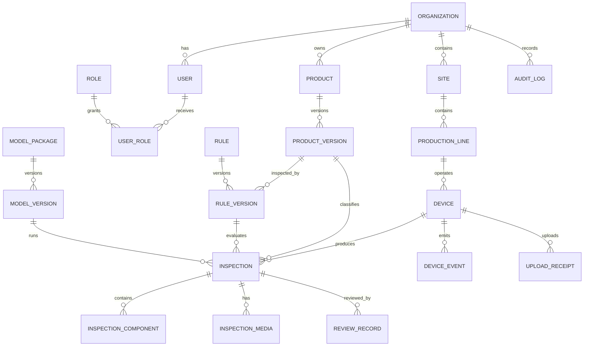

# 14. Data Model and Database

## 14.1 Purpose and Scope

This document defines the canonical AssemblyVision domain models and the separate edge and central persistence schemas. The edge database is an operational store optimized for uninterrupted inspection and upload recovery. The central PostgreSQL database is the system of record for fleet configuration, synchronized inspection history, review, and audit.

> **M1 implementation boundary.** In the M1 read-only milestone (ADR-012) the
> edge SQLite database is a **rebuildable read projection** of the CLI
> `inspection.json` bundles, not the authoritative operational store described
> below. It can be deleted and rebuilt from the same bundles, it is not the
> completion/outbox store, and its schema does not yet carry the unique
> constraints, product-configuration column, or upload leases required by the
> production design. The authoritative store is built together with the upload
> scheduler; until then this design describes the target, not the current
> implementation (AUDIT-001).

Related documents: [REST API and Events](15-rest-api-and-events.md), [Edge Dashboard](16-edge-dashboard.md), [Central Admin Dashboard](17-central-admin-dashboard.md), and [Training and Evaluation](19-training-and-evaluation.md).

## 14.2 Data Conventions

| Concern | Convention |
|---|---|
| Identifiers | Application-generated UUIDs; UUIDv7 is preferred for new records. Never reuse a database sequence as a synchronization identity. |
| Time | UTC, timezone-aware ISO 8601 at APIs; `TIMESTAMPTZ` centrally; UTC text or integer epoch in SQLite. Record device capture time and central receive time separately. |
| Coordinates | Pixel-space `xyxy`, origin at the upper-left, right/bottom bounds exclusive. Include source image dimensions. |
| Confidence | Floating point in `[0, 1]`; absence of evidence is not confidence `0`. |
| Decisions | Internal `OK`, `NG`, or `UNCERTAIN`; `UNCERTAIN` always maps to the business/physical `NG` path. |
| Versioning | Model, product, and rule versions are immutable identifiers captured on every inspection. |
| JSON | Use JSON only for bounded snapshots or evolving detail. Query-critical values remain typed columns. |
| Deletion | Configuration uses archive/soft deletion. Inspection and audit deletion is a controlled retention operation, not an ordinary API delete. |

## 14.3 Canonical Pydantic 2 Models

These transport/domain models are independent of SQLAlchemy persistence classes. They form the FastAPI schema source of truth.

```python
from __future__ import annotations

from datetime import datetime
from enum import StrEnum
from typing import Annotated, Literal
from uuid import UUID

from pydantic import BaseModel, ConfigDict, Field, model_validator

Confidence = Annotated[float, Field(ge=0.0, le=1.0)]
NonNegativeInt = Annotated[int, Field(ge=0)]


class APIModel(BaseModel):
    model_config = ConfigDict(extra="forbid", from_attributes=True)


class InternalDecision(StrEnum):
    OK = "OK"
    NG = "NG"
    UNCERTAIN = "UNCERTAIN"


class BusinessResult(StrEnum):
    OK = "OK"
    NG = "NG"


class InspectionLifecycle(StrEnum):
    OPEN = "OPEN"
    EVALUATING = "EVALUATING"
    COMPLETED = "COMPLETED"
    ABORTED = "ABORTED"


class UploadTaskState(StrEnum):
    PENDING = "PENDING"
    IN_PROGRESS = "IN_PROGRESS"
    RETRY_WAIT = "RETRY_WAIT"
    SUCCEEDED = "SUCCEEDED"
    PERMANENT_FAILURE = "PERMANENT_FAILURE"
    CANCELLED = "CANCELLED"


class DeviceOperationalState(StrEnum):
    STARTING = "STARTING"
    READY = "READY"
    INSPECTING = "INSPECTING"
    DEGRADED = "DEGRADED"
    PAUSED = "PAUSED"
    MAINTENANCE = "MAINTENANCE"
    FAULTED = "FAULTED"


class MediaLifecycle(StrEnum):
    PENDING = "PENDING"
    AVAILABLE = "AVAILABLE"
    FAILED = "FAILED"
    PURGED = "PURGED"


class BoundingBox(APIModel):
    x_min: Annotated[float, Field(ge=0)]
    y_min: Annotated[float, Field(ge=0)]
    x_max: Annotated[float, Field(gt=0)]
    y_max: Annotated[float, Field(gt=0)]
    image_width: Annotated[int, Field(gt=0)]
    image_height: Annotated[int, Field(gt=0)]

    @model_validator(mode="after")
    def validate_bounds(self) -> BoundingBox:
        if not (self.x_min < self.x_max <= self.image_width):
            raise ValueError("x bounds must be ordered and inside the image")
        if not (self.y_min < self.y_max <= self.image_height):
            raise ValueError("y bounds must be ordered and inside the image")
        return self


class Detection(APIModel):
    class_name: str = Field(min_length=1, max_length=100)
    confidence: Confidence
    bbox: BoundingBox
    frame_id: UUID
    track_id: str | None = Field(default=None, max_length=100)


class FrameQuality(APIModel):
    usable: bool
    blur_score: Annotated[float, Field(ge=0)]
    brightness_mean: Annotated[float, Field(ge=0, le=255)]
    saturation_fraction: Confidence
    occlusion_fraction: Confidence | None = None
    reason_codes: list[str] = Field(default_factory=list)


class ReasonCount(APIModel):
    reason_code: str
    count: NonNegativeInt


class FrameQualitySummary(APIModel):
    total_frame_count: NonNegativeInt
    usable_frame_count: NonNegativeInt
    rejected_frame_count: NonNegativeInt
    reasons: list[ReasonCount] = Field(default_factory=list)


class BarcodeResult(APIModel):
    status: Literal["READ", "NOT_READ", "CONFLICT", "NOT_REQUIRED"]
    value: str | None = Field(default=None, max_length=256)
    symbology: str | None = Field(default=None, max_length=64)


class ProductResolution(APIModel):
    status: Literal["RESOLVED", "UNKNOWN", "CONFLICT"]
    source: Literal["BARCODE", "MANUAL", "CONFIGURED_DEFAULT", "NONE"]
    product_code: str | None = None
    product_version_id: UUID | None = None


class MediaMetadata(APIModel):
    media_id: UUID
    kind: Literal["KEY_FRAME", "ANNOTATED_FRAME", "PRODUCT_ROI", "NG_CLIP", "ROLLING_VIDEO"]
    lifecycle: MediaLifecycle
    relative_path: str
    mime_type: str
    size_bytes: NonNegativeInt
    checksum_sha256: str = Field(pattern=r"^[0-9a-f]{64}$")


class ProductDetection(APIModel):
    frame_id: UUID
    product_class: str
    confidence: Confidence
    bbox: BoundingBox
    model_version_id: UUID
    quality: FrameQuality


class ROIResult(APIModel):
    frame_id: UUID
    product_bbox: BoundingBox
    roi_bbox: BoundingBox
    roi_width: Annotated[int, Field(gt=0)]
    roi_height: Annotated[int, Field(gt=0)]
    orientation_degrees: float | None = None
    transform_full_to_roi: tuple[float, float, float, float, float, float]
    media_id: UUID | None = None


class ComponentDetection(APIModel):
    frame_id: UUID
    component_code: str
    confidence: Confidence
    roi_bbox: BoundingBox
    full_frame_bbox: BoundingBox
    model_version_id: UUID


class AggregatedComponentEvidence(APIModel):
    component_code: str
    state: Literal["PRESENT", "MISSING", "UNCERTAIN"]
    best_confidence: Confidence | None = None
    usable_frame_count: NonNegativeInt
    detection_count: NonNegativeInt
    adjacent_detection_run: NonNegativeInt
    supporting_frame_ids: list[UUID]
    policy_reason_codes: list[str]


class InspectionDecision(APIModel):
    internal_decision: InternalDecision
    business_result: BusinessResult
    missing_components: list[str]
    low_confidence_components: list[str]
    reason_codes: list[str]
    decided_at: datetime


class InspectionRecord(APIModel):
    inspection_id: UUID
    device_id: UUID
    device_sequence: Annotated[int, Field(gt=0)]
    lifecycle_status: InspectionLifecycle
    started_at: datetime
    completed_at: datetime
    barcode_result: BarcodeResult
    product_resolution: ProductResolution
    product_detection: ProductDetection | None = None
    roi_result: ROIResult | None = None
    frame_quality_summary: FrameQualitySummary
    application_version: str
    product_model_version_id: UUID
    product_model_checksum_sha256: str = Field(pattern=r"^[0-9a-f]{64}$")
    component_model_version_id: UUID
    component_model_checksum_sha256: str = Field(pattern=r"^[0-9a-f]{64}$")
    rule_version_id: UUID
    aggregation_policy_version: str
    evidence: list[AggregatedComponentEvidence]
    media: list[MediaMetadata]
    decision: InspectionDecision
    synchronization_status: Literal["LOCAL_ONLY", "QUEUED", "PARTIAL", "SYNCED", "FAILED"]
    processing_ms: NonNegativeInt


class UploadTask(APIModel):
    upload_task_id: UUID
    device_id: UUID
    inspection_id: UUID | None = None
    kind: Literal["INSPECTION", "MEDIA", "DEVICE_EVENT"]
    object_id: UUID
    payload_hash: str = Field(pattern=r"^[0-9a-f]{64}$")
    status: UploadTaskState
    idempotency_key: str
    checksum_sha256: str | None = Field(default=None, pattern=r"^[0-9a-f]{64}$")
    attempt_count: NonNegativeInt = 0
    next_attempt_at: datetime | None = None
    last_error_code: str | None = None
    created_at: datetime
    updated_at: datetime
    completed_at: datetime | None = None
    lease_owner: str | None = None
    lease_expires_at: datetime | None = None


class DeviceStatus(APIModel):
    device_id: UUID
    observed_at: datetime
    operational_state: DeviceOperationalState
    inspection_ready: bool
    sync_ready: bool
    camera_connected: bool
    model_loaded: bool
    central_connected: bool
    disk_free_bytes: NonNegativeInt
    upload_pending_count: NonNegativeInt
    current_product_model_version_id: UUID | None = None
    current_component_model_version_id: UUID | None = None
    current_rule_version_id: UUID | None = None
    alerts: list[str] = Field(default_factory=list)


class ProductConfiguration(APIModel):
    product_version_id: UUID
    product_id: UUID
    product_code: str
    version: Annotated[int, Field(gt=0)]
    barcode_patterns: list[str]
    required_component_codes: list[str]
    active_from: datetime | None = None


class ComponentPolicy(APIModel):
    component_code: str
    high_confidence: Confidence
    medium_confidence: Confidence
    minimum_medium_detections: Annotated[int, Field(gt=0)]
    require_adjacent_frames: bool = False


class RuleConfiguration(APIModel):
    rule_version_id: UUID
    rule_id: UUID
    product_version_id: UUID
    version: Annotated[int, Field(gt=0)]
    component_policies: list[ComponentPolicy]
    minimum_usable_frames: Annotated[int, Field(gt=0)]
    uncertain_maps_to_ng: Literal[True] = True
    published_at: datetime | None = None


class Artifact(APIModel):
    name: str
    uri: str
    sha256: str = Field(pattern=r"^[0-9a-f]{64}$")
    size_bytes: NonNegativeInt


class DatasetReference(APIModel):
    dataset_version: str
    purpose: Literal["TRAIN", "VALIDATION", "TEST", "ACCEPTANCE"]
    manifest_uri: str


class ModelMetric(APIModel):
    name: str
    value: float
    scope: str


class ModelManifest(APIModel):
    model_version_id: UUID
    model_id: UUID
    semantic_version: str
    task: Literal["PRODUCT_DETECTION", "COMPONENT_DETECTION"]
    runtime: str
    input_width: Annotated[int, Field(gt=0)]
    input_height: Annotated[int, Field(gt=0)]
    class_names: list[str]
    artifacts: list[Artifact]
    datasets: list[DatasetReference]
    split_strategy: str
    source_revision: str
    training_config_revision: str
    metrics: list[ModelMetric]
    limitations: list[str]
    approved_by: str | None = None
    approved_at: datetime | None = None
    supersedes_model_version_id: UUID | None = None
    created_at: datetime


class ComponentCorrection(APIModel):
    component_code: str
    state: Literal["PRESENT", "MISSING", "UNCERTAIN"]


class ReviewRecord(APIModel):
    review_id: UUID
    inspection_id: UUID
    reviewer_user_id: UUID
    original_internal_decision: InternalDecision
    original_business_result: BusinessResult
    reviewed_disposition: Literal["CONFIRMED_OK", "CONFIRMED_NG", "REINSPECT", "INCONCLUSIVE"]
    component_corrections: list[ComponentCorrection]
    reason_code: str
    comment: str | None = Field(default=None, max_length=2000)
    reviewed_at: datetime
    revision: Annotated[int, Field(gt=0)]
```

The 15 required public models are `BoundingBox`, `Detection`, `FrameQuality`, `ProductDetection`, `ROIResult`, `ComponentDetection`, `AggregatedComponentEvidence`, `InspectionDecision`, `InspectionRecord`, `UploadTask`, `DeviceStatus`, `ProductConfiguration`, `RuleConfiguration`, `ModelManifest`, and `ReviewRecord`. Barcode, resolution, lifecycle, media, dataset, metric, and correction types are supporting value objects and are still part of the generated API contract.

## 14.4 Matching TypeScript Types

These interfaces show the expected generated shape. Frontends should import generated types, not maintain this block manually. UUIDs and date-times remain branded aliases at application boundaries because JSON carries strings.

```typescript
export type UUID = string;
export type ISODateTime = string;
export type InternalDecision = "OK" | "NG" | "UNCERTAIN";
export type BusinessResult = "OK" | "NG";
export type InspectionLifecycle = "OPEN" | "EVALUATING" | "COMPLETED" | "ABORTED";
export type UploadTaskState = "PENDING" | "IN_PROGRESS" | "RETRY_WAIT" | "SUCCEEDED" | "PERMANENT_FAILURE" | "CANCELLED";
export type DeviceOperationalState = "STARTING" | "READY" | "INSPECTING" | "DEGRADED" | "PAUSED" | "MAINTENANCE" | "FAULTED";
export type MediaLifecycle = "PENDING" | "AVAILABLE" | "FAILED" | "PURGED";

export interface BoundingBox { x_min: number; y_min: number; x_max: number; y_max: number; image_width: number; image_height: number }
export interface Detection { class_name: string; confidence: number; bbox: BoundingBox; frame_id: UUID; track_id: string | null }
export interface FrameQuality { usable: boolean; blur_score: number; brightness_mean: number; saturation_fraction: number; occlusion_fraction: number | null; reason_codes: string[] }
export interface ReasonCount { reason_code: string; count: number }
export interface FrameQualitySummary { total_frame_count: number; usable_frame_count: number; rejected_frame_count: number; reasons: ReasonCount[] }
export interface BarcodeResult { status: "READ" | "NOT_READ" | "CONFLICT" | "NOT_REQUIRED"; value: string | null; symbology: string | null }
export interface ProductResolution { status: "RESOLVED" | "UNKNOWN" | "CONFLICT"; source: "BARCODE" | "MANUAL" | "CONFIGURED_DEFAULT" | "NONE"; product_code: string | null; product_version_id: UUID | null }
export interface MediaMetadata { media_id: UUID; kind: "KEY_FRAME" | "ANNOTATED_FRAME" | "PRODUCT_ROI" | "NG_CLIP" | "ROLLING_VIDEO"; lifecycle: MediaLifecycle; relative_path: string; mime_type: string; size_bytes: number; checksum_sha256: string }
export interface ProductDetection { frame_id: UUID; product_class: string; confidence: number; bbox: BoundingBox; model_version_id: UUID; quality: FrameQuality }
export interface ROIResult { frame_id: UUID; product_bbox: BoundingBox; roi_bbox: BoundingBox; roi_width: number; roi_height: number; orientation_degrees: number | null; transform_full_to_roi: [number, number, number, number, number, number]; media_id: UUID | null }
export interface ComponentDetection { frame_id: UUID; component_code: string; confidence: number; roi_bbox: BoundingBox; full_frame_bbox: BoundingBox; model_version_id: UUID }
export interface AggregatedComponentEvidence { component_code: string; state: "PRESENT" | "MISSING" | "UNCERTAIN"; best_confidence: number | null; usable_frame_count: number; detection_count: number; adjacent_detection_run: number; supporting_frame_ids: UUID[]; policy_reason_codes: string[] }
export interface InspectionDecision { internal_decision: InternalDecision; business_result: BusinessResult; missing_components: string[]; low_confidence_components: string[]; reason_codes: string[]; decided_at: ISODateTime }
export interface InspectionRecord { inspection_id: UUID; device_id: UUID; device_sequence: number; lifecycle_status: InspectionLifecycle; started_at: ISODateTime; completed_at: ISODateTime; barcode_result: BarcodeResult; product_resolution: ProductResolution; product_detection: ProductDetection | null; roi_result: ROIResult | null; frame_quality_summary: FrameQualitySummary; application_version: string; product_model_version_id: UUID; product_model_checksum_sha256: string; component_model_version_id: UUID; component_model_checksum_sha256: string; rule_version_id: UUID; aggregation_policy_version: string; evidence: AggregatedComponentEvidence[]; media: MediaMetadata[]; decision: InspectionDecision; synchronization_status: "LOCAL_ONLY" | "QUEUED" | "PARTIAL" | "SYNCED" | "FAILED"; processing_ms: number }
export interface UploadTask { upload_task_id: UUID; device_id: UUID; inspection_id: UUID | null; kind: "INSPECTION" | "MEDIA" | "DEVICE_EVENT"; object_id: UUID; payload_hash: string; status: UploadTaskState; idempotency_key: string; checksum_sha256: string | null; attempt_count: number; next_attempt_at: ISODateTime | null; last_error_code: string | null; created_at: ISODateTime; updated_at: ISODateTime; completed_at: ISODateTime | null; lease_owner: string | null; lease_expires_at: ISODateTime | null }
export interface DeviceStatus { device_id: UUID; observed_at: ISODateTime; operational_state: DeviceOperationalState; inspection_ready: boolean; sync_ready: boolean; camera_connected: boolean; model_loaded: boolean; central_connected: boolean; disk_free_bytes: number; upload_pending_count: number; current_product_model_version_id: UUID | null; current_component_model_version_id: UUID | null; current_rule_version_id: UUID | null; alerts: string[] }
export interface ProductConfiguration { product_version_id: UUID; product_id: UUID; product_code: string; version: number; barcode_patterns: string[]; required_component_codes: string[]; active_from: ISODateTime | null }
export interface ComponentPolicy { component_code: string; high_confidence: number; medium_confidence: number; minimum_medium_detections: number; require_adjacent_frames: boolean }
export interface RuleConfiguration { rule_version_id: UUID; rule_id: UUID; product_version_id: UUID; version: number; component_policies: ComponentPolicy[]; minimum_usable_frames: number; uncertain_maps_to_ng: true; published_at: ISODateTime | null }
export interface Artifact { name: string; uri: string; sha256: string; size_bytes: number }
export interface DatasetReference { dataset_version: string; purpose: "TRAIN" | "VALIDATION" | "TEST" | "ACCEPTANCE"; manifest_uri: string }
export interface ModelMetric { name: string; value: number; scope: string }
export interface ModelManifest { model_version_id: UUID; model_id: UUID; semantic_version: string; task: "PRODUCT_DETECTION" | "COMPONENT_DETECTION"; runtime: string; input_width: number; input_height: number; class_names: string[]; artifacts: Artifact[]; datasets: DatasetReference[]; split_strategy: string; source_revision: string; training_config_revision: string; metrics: ModelMetric[]; limitations: string[]; approved_by: string | null; approved_at: ISODateTime | null; supersedes_model_version_id: UUID | null; created_at: ISODateTime }
export interface ComponentCorrection { component_code: string; state: "PRESENT" | "MISSING" | "UNCERTAIN" }
export interface ReviewRecord { review_id: UUID; inspection_id: UUID; reviewer_user_id: UUID; original_internal_decision: InternalDecision; original_business_result: BusinessResult; reviewed_disposition: "CONFIRMED_OK" | "CONFIRMED_NG" | "REINSPECT" | "INCONCLUSIVE"; component_corrections: ComponentCorrection[]; reason_code: string; comment: string | null; reviewed_at: ISODateTime; revision: number }
```

### 14.4.1 API Supporting Schema Registry

Every named schema in [REST API and Events](15-rest-api-and-events.md) must be a typed Pydantic
model in OpenAPI. The minimum registry is:

| Schema family | Required models |
|---|---|
| Errors and pagination | `Problem`, `ProblemFieldError`, `Page[T]`, opaque cursor metadata |
| Runtime | `CameraState`, `InspectionRuntimeState`, `OperationAccepted`, `EffectiveConfiguration`, `ValidationResult` |
| Inspection queries | `InspectionSummary`, `CentralInspectionDetail`, `MediaMetadata` |
| Ingestion | `UploadReceipt`, `MediaUploadInitiate`, `MediaUploadComplete`, `DeviceEventBatch`, per-item receipt |
| Configuration | `ConfigurationCandidate`, `LocalOverrides`, `DesiredConfiguration`, assignment/validation/activation acknowledgement |
| Administration | typed site, line, device, user, dashboard, report, and audit request/response projections |

`Problem` uses the `application/problem+json` fields in the API contract. Request models retain
`extra="forbid"`; WebSocket event payload consumers allow unknown additive fields within the same
schema version. Event `sequence` is monotonic per `(source_id, channel)` and resets only when the
source identity changes.

## 14.5 Edge Schema

SQLite is the MVP default. Enable WAL mode, foreign keys, `busy_timeout`, and `synchronous=FULL` where inspection throughput permits. Keep one short writer transaction per finalized frame or inspection; media bytes stay in the filesystem.

| Table | Key and principal columns | Constraints and purpose |
|---|---|---|
| `local_inspections` | `id` PK UUID, `device_id`, `device_sequence`, lifecycle, timestamps, barcode status/value, product resolution, internal decision, business result, application/product-model/component-model/rule versions and checksums, reason JSON, latency | `UNIQUE(device_id, device_sequence)`; durable product-level result and synchronization unit. |
| `local_detection_frames` | `id` PK, `inspection_id` FK, `frame_index`, captured time, quality fields, product bbox JSON | `UNIQUE(inspection_id, frame_index)`; optional detailed evidence subject to shorter retention. |
| `local_component_evidence` | `id` PK, `inspection_id` FK, component code, state, confidence/count fields, reason JSON | `UNIQUE(inspection_id, component_code)`; final per-component evidence. |
| `local_media_files` | `id` PK, `inspection_id` FK nullable, kind, relative path, MIME type, bytes, SHA-256, captured time, upload-required flag | Path must be relative to the configured media root; `UNIQUE(relative_path)` and `UNIQUE(sha256, kind)` where deduplication is safe. |
| `upload_tasks` | `id` PK, device/inspection/object IDs, kind, payload hash, checksum, idempotency key, canonical state, attempts, lease owner/expiry, next attempt, timestamps, error | `UNIQUE(device_id, idempotency_key)`; persistent outbox with recoverable leases. |
| `device_events` | `id` PK, occurred time, severity, event code, details JSON, upload state | Append-only operational event stream. |
| `local_configuration` | `key` PK, revision, value JSON, source, applied time, checksum | Atomic effective configuration snapshot; retain prior snapshots in history or event records. |
| `model_installations` | `model_version_id` PK, manifest JSON, local path, SHA-256, state, installed/activated times | Only one active installation per task, enforced transactionally. |
| `rule_installations` | `rule_version_id` PK, product version ID, document JSON, checksum, state, installed/activated times | Activation validates compatible model classes and product version. |

Required edge indexes:

```sql
CREATE INDEX ix_local_inspections_completed ON local_inspections(completed_at DESC);
CREATE INDEX ix_local_inspections_barcode ON local_inspections(barcode) WHERE barcode IS NOT NULL;
CREATE INDEX ix_local_inspections_result_time ON local_inspections(business_result, completed_at DESC);
CREATE INDEX ix_upload_tasks_due ON upload_tasks(state, next_attempt_at);
CREATE INDEX ix_media_inspection_kind ON local_media_files(inspection_id, kind);
CREATE INDEX ix_device_events_time ON device_events(occurred_at DESC);
```

## 14.6 Central Schema

PostgreSQL owns tenant isolation and global history. Every tenant-owned row carries `organization_id`; repository queries must scope it even if row-level security is later enabled.

| Table | Key and principal columns | Constraints and purpose |
|---|---|---|
| `organizations` | UUID PK, unique slug, name, status | Tenant root; archive rather than delete. |
| `sites` | UUID PK, organization FK, code, name, timezone | `UNIQUE(organization_id, code)`. |
| `production_lines` | UUID PK, site FK, code, name | `UNIQUE(site_id, code)`. |
| `devices` | UUID PK, line FK, device code, certificate identity, state, last seen | `UNIQUE(organization_id, device_code)`; certificate identity separately unique. |
| `users`, `roles`, `user_roles` | UUID keys, organization scope, identity subject, role name, join rows | Identity-provider subject unique; assignment has composite uniqueness. |
| `products`, `product_components` | Product UUID/code; component code/name/active state | Component membership is versioned through product-version snapshots, not overwritten in historical inspections. |
| `product_versions` | UUID PK, product FK, integer version, immutable configuration JSON, published time | `UNIQUE(product_id, version)`; no update after publish. |
| `rules`, `rule_versions` | Stable rule identity and immutable version document with product version FK | Drafts editable; published versions immutable and uniquely numbered. |
| `model_packages`, `model_versions` | Stable model identity; task, semantic version, manifest, artifact URI/checksum, lifecycle state | `UNIQUE(model_id, semantic_version)`; immutable after publication. |
| `inspections` | UUID PK matching edge ID, organization/device FKs, device sequence, lifecycle/times, barcode/product resolution, internal decision, business result, application/product-model/component-model/rule versions and checksums, latency, received time | `UNIQUE(device_id, device_sequence)`; preserves exact runtime versions. |
| `inspection_components` | UUID PK, inspection FK, component code, state, confidence/counts, reasons | `UNIQUE(inspection_id, component_code)`. |
| `inspection_media` | UUID PK matching edge object ID, inspection FK, kind, object key, MIME, bytes, SHA-256, capture/receive times | `UNIQUE(device_id, source_media_id)` and immutable object key after verification. |
| `review_records` | UUID PK, inspection/reviewer FKs, outcomes, corrections, reason, revision, time | `UNIQUE(inspection_id, revision)`; revisions append, never overwrite. |
| `device_events` | UUID PK matching source event ID, device FK, source/receive times, severity/code/details | Idempotent event ingestion. |
| `upload_receipts` | UUID PK, device FK, idempotency key, request hash, resource type/ID, status, response code/time | `UNIQUE(device_id, idempotency_key)`; hash mismatch is a conflict. |
| `audit_logs` | UUID PK, organization/actor, action, resource type/ID, before/after JSON, request/correlation IDs, IP, time | Append-only security and configuration audit. |

Use monthly range partitioning for `inspections`, `device_events`, and `audit_logs` only after measured volume justifies it. Premature partitioning complicates foreign keys and migrations.

## 14.7 Entity Relationships



The edge equivalents of `INSPECTION`, `INSPECTION_COMPONENT`, and media retain the same IDs, allowing central ingestion without identity translation.

## 14.8 Keys, Indexes, and Query Paths

- Primary keys are UUIDs generated before persistence. The edge can therefore create records offline.
- Business keys are organization slug, site/line/device code, product code, component code, `(device_id, device_sequence)`, and version numbers within their stable parent.
- Index central barcode queries with `(organization_id, barcode, completed_at DESC)` and use a partial predicate excluding null barcodes. Do not globally constrain barcode uniqueness because rework and duplicate reads are possible.
- Index dashboard time scans with `(organization_id, completed_at DESC)` and `(device_id, completed_at DESC)`. Add `(organization_id, business_result, completed_at DESC)` for NG queues and indexes for product/model/rule/reason query paths.
- Index pending reviews with a partial index on inspections whose business result is `NG` and review status is pending; internal `UNCERTAIN` remains a filterable reason/state.
- Index all foreign keys used in joins. Validate plans with production-like cardinality before adding confidence/component composite indexes.
- Use keyset pagination `(completed_at, id) < (:cursor_time, :cursor_id)` for history. Offset pagination is acceptable only for small configuration lists.

## 14.9 Media Metadata and Integrity

Databases store media metadata, never large image/video blobs. Edge writes to a temporary path, `fsync`s where supported, atomically renames, calculates SHA-256, then commits metadata and its upload task. Central upload uses a staged object key; the API verifies size and checksum before marking media available. A database row must not claim `AVAILABLE` until the final object exists.

Object keys are opaque and tenant scoped, for example `org/{organization_id}/device/{device_id}/2026/08/04/{media_id}.jpg`. API responses issue authorized short-lived URLs rather than exposing storage credentials.

## 14.10 Retention and Safe Cleanup

Retention values are deployment configuration, not hard-coded defaults. The cleanup worker applies this order:

1. Never remove a media file with a nonterminal required upload task.
2. Prefer removing rolling video and uploaded OK media before NG evidence.
3. Delete the file/object, verify absence, then mark metadata `PURGED` with reason and timestamp.
4. Retain inspection metadata longer than high-volume frame and media detail.
5. Apply legal hold and investigation hold before any policy.
6. Delete central objects and database detail through a recorded retention job; retain a tombstone if required for audit reconciliation.

Suggested policy classes, pending customer approval, are rolling video (hours/days), frame detail (days), OK key frames (short), NG evidence (longer), inspection metadata (long), operational logs (bounded), and audit logs (security/compliance term). See the task requirements in [the source brief](../source-brief.md#7-local-storage-architecture).

## 14.11 Audit and Mutation Rules

- Audit login, role assignment, device enrollment, configuration draft/publish/activation, model lifecycle changes, manual review, export, retention, and break-glass actions.
- Store actor type (`USER`, `DEVICE`, `SYSTEM`), actor ID, action, target, before/after values with secrets removed, UTC time, request ID, and reason where required.
- Published product, model, and rule versions are immutable. Correction creates a new version.
- Reviews are append-only revisions. The latest revision is projected for the UI, while all revisions remain queryable.
- Audit rows are append-only to the application role. Administrative alteration requires a separately logged operational procedure.
- Sensitive barcode and identity data must be masked in general logs and exports according to customer policy.

## 14.12 Migration and Recovery

Alembic owns both schemas through separate migration branches/configurations. Edge upgrades take a database backup, stop new inspection windows, apply forward migrations, validate schema revision, and resume. Long SQLite rewrites require disk-space preflight. Central migrations use expand/migrate/contract changes so mixed API versions can run during deployment.

Edge recovery reconciles media paths, expired upload leases, and incomplete inspection windows at startup. An interrupted window is persisted with lifecycle status `ABORTED`; if a business result is required it is `NG`, and the record can never become `OK`. Database backups do not replace media backup policy.

## 14.13 OpenAPI Synchronization Strategy

1. Pydantic models in the shared Python domain package are referenced directly by FastAPI request and response declarations.
2. CI starts/imports each API and emits deterministic `edge-openapi.json` and `central-openapi.json` with a pinned FastAPI/Pydantic toolchain.
3. CI validates each document and checks the committed/generated artifact for drift.
4. `openapi-typescript` or Orval generates TypeScript schemas and clients into `packages/typescript/api-client/generated`; generated files are not manually edited.
5. Frontend wrappers add transport concerns such as authentication and error mapping without redefining payloads.
6. Contract tests deserialize representative server responses and run TypeScript type-checking. Breaking schema changes require a versioned endpoint or a coordinated release.
7. Date-time and UUID runtime validation is added at frontend boundaries where needed; generated TypeScript types alone do not validate JSON.

OpenAPI covers REST snapshots and WebSocket event payload schemas referenced by name. Because OpenAPI does not fully describe WebSocket channels, event envelopes are exported as JSON Schema from the same Pydantic classes and tested against frontend validators.

## 14.14 Open Questions and Validation Required

- Confirm expected inspection, frame, event, and media volumes per device and retention class.
- Confirm whether local SQLite is sufficient or a larger edge installation requires PostgreSQL.
- Confirm barcode formats, sensitivity classification, and whether barcode search needs normalized variants.
- Agree central and edge retention periods, legal holds, deletion evidence, and audit retention with the customer.
- Confirm tenant isolation requirements and whether PostgreSQL row-level security is mandatory.
- Confirm customer clock synchronization capability and acceptable clock-drift handling.
- Validate UUIDv7 library/tooling support in the selected Python and PostgreSQL versions.
- Define whether the internal `UNCERTAIN` state is externally visible as explanatory detail; its business and physical path remains `NG`.
