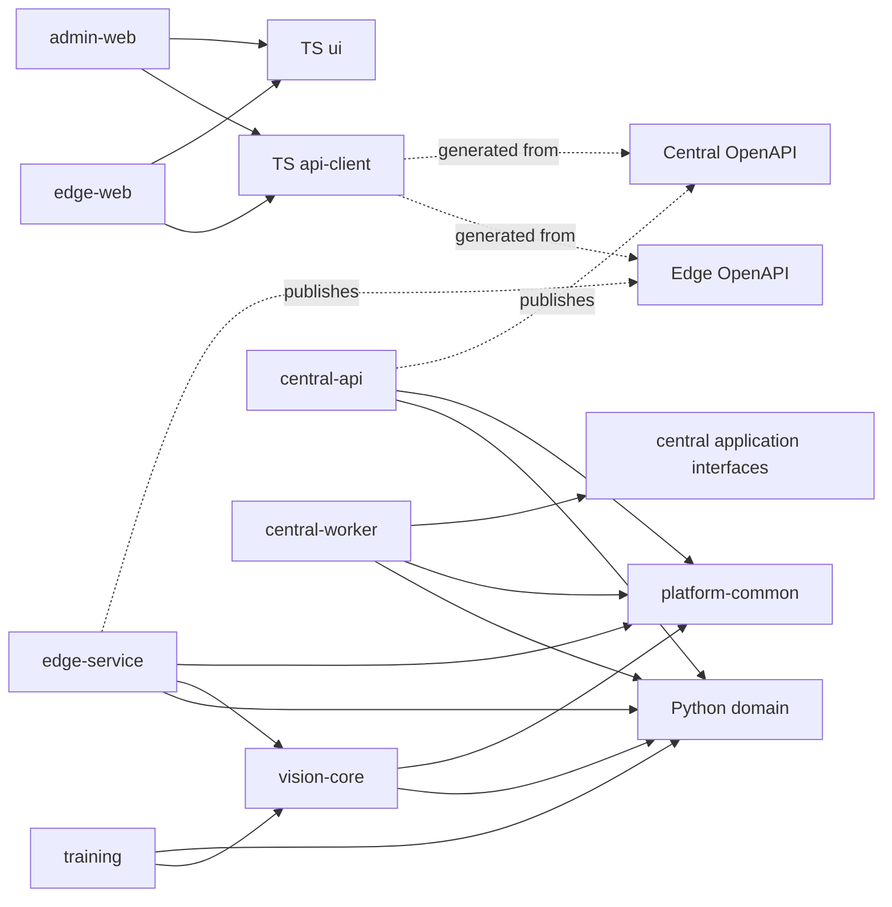

# 18. Monorepo and Code Organization

## 18.1 Goals

AssemblyVision uses one Python/TypeScript monorepo to coordinate domain contracts, edge and central releases, frontend clients, migrations, deployment, and evaluation. The repository must preserve runtime boundaries without creating a package for every pipeline step.

Related contracts are defined in [Data Model and Database](14-data-model-and-database.md) and [REST API and Events](15-rest-api-and-events.md). Frontend ownership is described in [Edge Dashboard](16-edge-dashboard.md) and [Central Admin Dashboard](17-central-admin-dashboard.md); ML workflow is described in [Training and Evaluation](19-training-and-evaluation.md).

## 18.2 Organization Principles

1. `apps/` contains independently runnable/deployable processes and web applications.
2. `packages/` contains code reused by at least two applications or a cohesive domain that requires independent tests.
3. Keep product detection, ROI, component detection, temporal aggregation, and rules together in `vision-core` until independent reuse or dependency isolation is demonstrated.
4. Runtime application code never imports from `training/`.
5. Edge code must not import central persistence or require a central connection.
6. Frontends consume generated API contracts and small shared visual primitives; page-specific stores and components remain in their app.
7. Production data, credentials, datasets, and model weights are external artifacts and ignored by Git.
8. Each deployable app owns composition/configuration; shared packages must not read environment variables at import time.

## 18.3 Proposed Repository Tree

```text
assembly-vision/
├── apps/
│   ├── edge-service/
│   │   ├── src/assemblyvision_edge/
│   │   │   ├── api/
│   │   │   ├── application/
│   │   │   ├── infrastructure/
│   │   │   └── main.py
│   │   ├── migrations/
│   │   ├── tests/
│   │   └── pyproject.toml
│   ├── edge-web/
│   │   ├── src/{pages,components,stores,router,services}/
│   │   ├── tests/
│   │   └── package.json
│   ├── central-api/
│   │   ├── src/assemblyvision_central/
│   │   │   ├── api/
│   │   │   ├── application/
│   │   │   ├── infrastructure/
│   │   │   └── main.py
│   │   ├── migrations/
│   │   ├── tests/
│   │   └── pyproject.toml
│   ├── central-worker/
│   │   ├── src/assemblyvision_worker/
│   │   ├── tests/
│   │   └── pyproject.toml
│   └── admin-web/
│       ├── src/{pages,components,stores,router,services}/
│       ├── tests/
│       └── package.json
├── packages/
│   ├── python/
│   │   ├── domain/
│   │   │   ├── src/assemblyvision_domain/
│   │   │   │   ├── models.py
│   │   │   │   ├── events.py
│   │   │   │   └── errors.py
│   │   │   └── pyproject.toml
│   │   ├── vision-core/
│   │   │   ├── src/assemblyvision_vision/
│   │   │   │   ├── sources/
│   │   │   │   ├── camera/
│   │   │   │   ├── barcode/
│   │   │   │   ├── detection/
│   │   │   │   ├── roi/
│   │   │   │   ├── aggregation/
│   │   │   │   ├── rules/
│   │   │   │   └── pipeline.py
│   │   │   ├── tests/
│   │   │   └── pyproject.toml
│   │   └── platform-common/
│   │       ├── src/assemblyvision_common/
│   │       │   ├── config.py
│   │       │   ├── logging.py
│   │       │   ├── telemetry.py
│   │       │   └── checksums.py
│   │       └── pyproject.toml
│   └── typescript/
│       ├── api-client/
│       │   ├── src/{edge,central,generated}/
│       │   └── package.json
│       ├── ui/
│       │   ├── src/{status,detection-viewer,formatters}/
│       │   └── package.json
│       └── eslint-config/
│           └── package.json
├── training/
│   ├── assemblyvision_training/
│   │   ├── data/
│   │   ├── product_detector/
│   │   ├── component_detector/
│   │   ├── evaluation/
│   │   └── manifests/
│   ├── configs/
│   ├── tests/
│   └── pyproject.toml
├── models/
│   ├── README.md
│   └── manifests/
├── deploy/
│   ├── docker/
│   │   ├── edge.Dockerfile
│   │   ├── central-api.Dockerfile
│   │   ├── central-worker.Dockerfile
│   │   └── web.Dockerfile
│   ├── compose/
│   │   ├── edge.compose.yml
│   │   └── central.compose.yml
│   ├── nginx/
│   └── env/
├── config/
│   ├── schemas/
│   └── examples/
├── tests/
│   ├── contract/
│   ├── e2e/
│   ├── resilience/
│   ├── performance/
│   └── fixtures/
├── docs/
│   ├── design/
│   │   └── decisions/
│   └── README.md
├── scripts/
├── .github/workflows/
├── pyproject.toml
├── uv.lock
├── package.json
├── pnpm-lock.yaml
├── pnpm-workspace.yaml
├── tsconfig.base.json
├── docker-compose.yml
├── Makefile
└── README.md
```

Brace notation above is explanatory shorthand; actual directories are ordinary directories. `edge-service` combines API, capture orchestration, pipeline execution, local persistence, and uploader in one process for the first production release. CPU/GPU-heavy inference may run in a supervised subprocess, but a separately deployable `edge-worker` is not justified until isolation or independent scaling is measured. Likewise, the two-day MVP is exposed as an `edge-service` CLI entry point rather than a separate `edge-cli` app.

## 18.4 Application Responsibilities

### 18.4.1 `edge-service`

Owns dependency composition for camera adapters, barcode readers, the inspection pipeline, SQLite repositories, filesystem media, persistent upload outbox, local API/WebSocket, startup recovery, and health. Infrastructure adapters implement domain-facing protocols. It must start and inspect without central credentials or connectivity.

Suggested internal direction is `api -> application -> domain/protocols`, with `infrastructure` implementing protocols. API handlers do not call SQLAlchemy directly. The capture callback must not perform database uploads or browser broadcasting synchronously.

### 18.4.2 `central-api`

Owns authentication/authorization, tenant scoping, ingestion, query APIs, configuration/model registry, review, audit, presigned media sessions, and WebSocket notification publication. It uses PostgreSQL and object storage. Small transactions complete inline.

### 18.4.3 `central-worker`

Runs only jobs that should outlive an HTTP request: report/export generation, media verification/derivative creation when expensive, retention batches, and notification fan-out if introduced. It is not needed for ordinary CRUD or inspection metadata ingestion. MVP can use a PostgreSQL-backed job table; Redis plus a worker framework is added only if retries, scheduling, or throughput justify it.

### 18.4.4 Web Applications

`edge-web` and `admin-web` own route-level features and deployment branding. They share generated API clients, detection coordinate rendering, basic status indicators, and formatting. Complex product/rule editors and fleet charts remain central-only; edge health/queue controls remain edge-only.

## 18.5 Python Package Boundaries

| Package | Contents | Must not contain |
|---|---|---|
| `domain` | Pydantic API/event value models, enums, stable error codes | FastAPI routers, SQLAlchemy tables, camera SDK, storage clients |
| `vision-core` | Image-source protocols, folder source, camera/barcode adapter protocols, YOLO wrappers, ROI, aggregation, deterministic rules, pipeline | Edge database, central APIs, dashboard code, training orchestration |
| `platform-common` | Narrow logging/config/checksum/telemetry utilities used by multiple apps | Domain business rules, generic “utils” dumping ground |

SQLAlchemy persistence models stay in each application because edge and central schemas differ. Upload protocol DTOs may live in `domain`; upload retry implementation belongs to `edge-service`. If only one app uses a helper, keep it in that app.

## 18.6 TypeScript Package Boundaries

- `api-client` contains deterministic generated clients for edge and central OpenAPI documents plus minimal auth/error wrappers. Generated code is isolated and replaceable.
- `ui` contains genuinely shared, presentation-focused components: detection viewer, status badge, media-safe formatting, and common accessible primitives. It does not contain route-aware components or application stores.
- `eslint-config` centralizes lint rules. A separate package for charts, domain types, auth, or validation is unnecessary initially; those remain in an app or API client until reuse is proven.
- Vue, Element Plus/Naive UI, and ECharts should be peer dependencies where appropriate to prevent duplicate runtime copies.

## 18.7 Dependency Diagram



The worker imports a small central application interface/library factored within `central-api` packaging or a later central-domain package; it must not import FastAPI route modules. No arrow from edge runtime to central runtime denotes a code/runtime dependency. The uploader communicates over the documented network contract.

## 18.8 MVP Versus Later Packages

### 18.8.1 Two-Day Static-Image MVP

Required: `edge-service` CLI entry point, `domain`, `vision-core` with folder source/detectors/ROI/rules, `training/evaluation` basics, model manifests, and focused tests. Not required: databases, web apps, central apps, temporal aggregation, upload, camera SDK, or shared TypeScript packages.

### 18.8.2 One-Month MVP

Required: all applications shown except that `central-worker` may remain a module/process only if asynchronous reports or media work ships. Required packages are `domain`, `vision-core`, `platform-common`, `api-client`, and a minimal `ui`. SQLite/PostgreSQL migrations, edge/central Compose definitions, contract tests, and resilience tests are included.

### 18.8.3 Add Only When Justified

Potential later packages include vendor-specific camera adapters with conflicting native dependencies, a dedicated MES/PLC integration package, central application/domain extraction for multiple processes, chart components reused by another app, and model-distribution tooling. Do not pre-create empty packages for them.

## 18.9 Dependency and Version Management

Use one root Python workspace with `uv` and per-app/package `pyproject.toml` declarations; production app lock resolution comes from committed `uv.lock`. Use pnpm workspaces with one committed lockfile. Pin major/minor runtime dependencies and model runtime/CUDA combinations explicitly. Renovation is reviewed with tests rather than blindly merged.

Python supports 3.12. TypeScript uses a strict base configuration. Each package exports only public entry points. Circular dependencies fail CI through import/dependency checks. Native camera SDKs and GPU packages use optional dependency groups so central images do not include them.

## 18.10 Configuration and Secrets

Typed settings live in each runnable app and compose shared primitives from `platform-common`. Resolution order is documented: defaults, configuration file, environment variables, then explicit approved runtime overrides. Example files contain no secrets. Credentials come from mounted secrets or deployment secret stores and are never part of model/configuration bundles.

Configuration schemas and examples under `config/` are source-controlled. Effective runtime configuration and version checksum are observable, with sensitive fields redacted.

## 18.11 Models, Data, and Generated Artifacts

- `models/manifests/` may contain small manifests and checksums for development references. Model weights live in an artifact registry/object store and are ignored by Git.
- `training/` contains reproducible code and small synthetic test fixtures, not production datasets or uncurated exports.
- Runtime databases, images, clips, logs, cache, and reports use explicit external volumes, never repository paths.
- OpenAPI documents and generated clients are produced deterministically. The chosen policy may commit generated output for easy frontend builds or regenerate in CI, but CI always checks drift.
- Built frontend assets and compiled Python runtime layers are build outputs, not source directories.

## 18.12 Testing Layout

Unit tests live beside their owning app/package. Root tests cover boundaries:

| Suite | Scope |
|---|---|
| `contract` | OpenAPI generation, client generation/type-check, event JSON Schema, edge-central ingestion compatibility |
| `e2e` | Browser plus deployed API/database/object store workflows |
| `resilience` | Network loss, restart, expired lease, disk-full, checksum mismatch, duplicate upload |
| `performance` | Pipeline latency, API/dashboard queries, upload recovery, sustained operation |
| `fixtures` | Small synthetic/non-sensitive images, API payloads, and factory builders |

Tests do not import fixtures from production data directories. ML evaluation datasets are versioned externally and invoked separately from fast CI.

## 18.13 CI and Build Flow

1. Validate formatting, Ruff, MyPy, ESLint, TypeScript, and Markdown links/diagrams where tooling is available.
2. Run changed-package unit tests, then contract and integration tests.
3. Generate OpenAPI and TypeScript clients and fail on drift.
4. Build each app in isolated multi-stage Docker builds using only declared workspace dependencies.
5. Scan dependencies/images and produce an SBOM.
6. Run Compose smoke tests for edge offline startup and central ingestion.
7. Publish immutable images/artifacts only from reviewed, tagged revisions; record source revision in manifests.

Training jobs are not part of every application CI run. Their code tests run in CI; full training/evaluation runs in a controlled ML environment and publishes signed/verified reports and model artifacts.

## 18.14 Ownership and Change Rules

Use code owners for vision/rules, edge runtime, central/security, frontend shared packages, migrations, and training/evaluation. A Pydantic contract change requires API/client drift checks. A published event change requires compatibility review. Database changes require migration and rollback/forward-recovery notes. Shared UI additions require two concrete consumers; otherwise they remain local.

## 18.15 Open Questions and Validation Required

- Select `uv` workspace and pnpm versions supported by the build environment.
- Confirm CI provider, container registry, artifact/model registry, and SBOM/signing requirements.
- Confirm whether camera SDK licensing or native libraries require a separately built adapter package/image.
- Decide whether generated OpenAPI clients are committed or generated during every consumer build.
- Validate whether report/media workloads justify `central-worker` and a job broker in the one-month MVP.
- Confirm supported edge operating system, CPU/GPU architecture, and offline dependency installation process.
