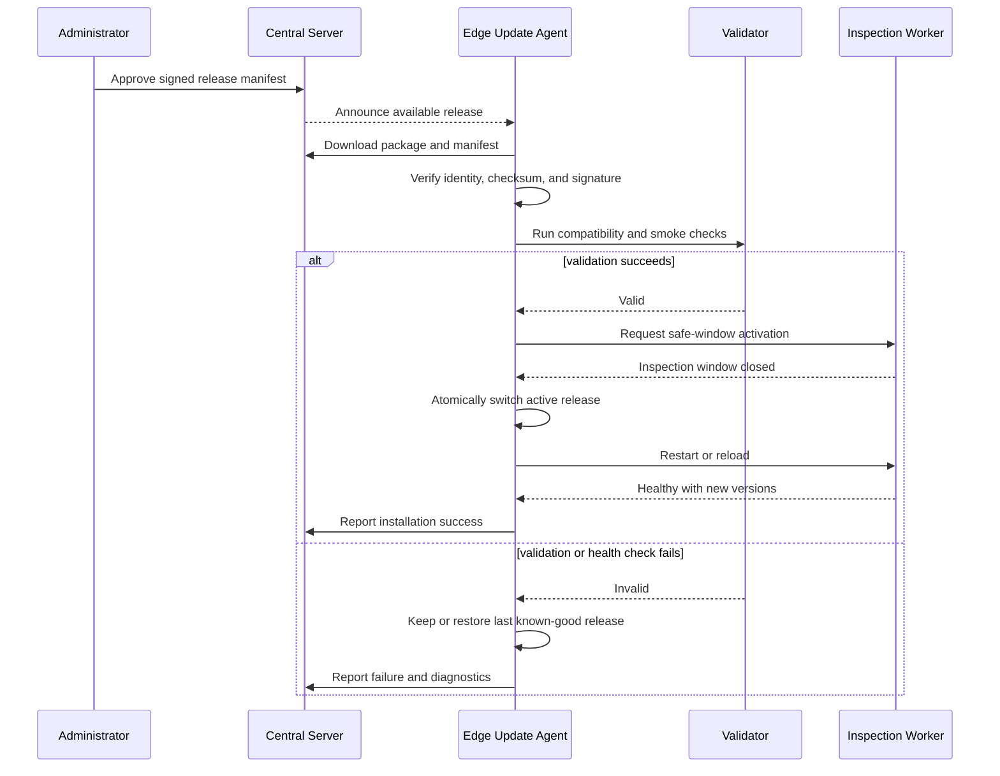

# 20. Deployment and Operations

## 20.1 Purpose and Scope

This document defines how AssemblyVision is packaged, installed, upgraded, operated, backed up, and recovered. It covers the edge inspection system and the central services without making the central server a dependency of real-time inspection.

### 20.1.1 Current and MVP Scope

- The static train-and-inspect MVP runs from a developer environment. A developer-only training CLI produces local model artifacts; the inspection CLI produces JSON, ROI images, annotated images, and held-out verification output.
- This MVP does not implement encrypted model artifacts or `.pyc`-only customer runtime packaging; training code is simply excluded from any runtime distribution.
- The one-month target packages edge and central applications with Docker Compose.
- SQLite is acceptable for the initial edge database; PostgreSQL is the central database.
- Persistent runtime data is stored outside container layers.
- Kubernetes is not required at the edge.

### 20.1.2 Production Target

- Reproducible multi-stage images, pinned by immutable version or digest.
- Non-root containers, health checks, restart policies, resource limits, and explicit persistent volumes.
- Offline edge inspection with a persistent upload queue.
- Controlled, reversible configuration, rule, application, and model deployment.
- Backups and restore exercises for configuration, databases, and required evidence.

### 20.1.3 Future Scope

- Central deployment on Kubernetes if scale or organizational standards justify it.
- Fleet rollout orchestration and staged deployment rings.
- Optional PostgreSQL at unusually large edge installations.

## 20.2 Deployment Units

| Unit | Location | Responsibility | Required for inspection |
|---|---|---|---|
| `edge-service` | Edge | Local API, camera/barcode orchestration, inference, aggregation, persistence, upload, and health | Yes |
| `edge-web` | Edge | Offline-capable operator dashboard | No, but operationally important |
| `nginx-edge` | Edge | Static UI and local reverse proxy | No |
| `central-api` | Central | Ingestion, administration, reporting APIs | No |
| `central-worker` | Central | Optional media processing, reports, notifications, package preparation | No |
| `admin-web` | Central | Administration and review UI | No |
| `postgres` | Central | Central transactional store | No |
| `object-storage` | Central | Uploaded image and clip storage | No |
| `redis` | Central | Optional job broker/cache; only when workers require it | No |

Camera access may require a vendor SDK, host device mapping, or a host-side adapter. This integration must be validated before selecting container isolation and device permissions.

## 20.3 Image Construction

Each application uses a multi-stage build. The build stage resolves pinned dependencies, runs compilation, and emits only runtime artifacts. The runtime stage contains no Git metadata, tests, training data, notebooks, or package-manager caches. Python modules may be compiled to `.pyc` and original project `.py` files removed where practical; this is packaging hygiene, not strong code protection.

Runtime requirements are:

1. Run as a dedicated non-root UID/GID.
2. Mount application code read-only and runtime directories explicitly.
3. Write only to database, media, queue, temporary, and log volumes.
4. Receive secrets at runtime, never through image layers or frontend bundles.
5. Expose a build identifier and application version through the health API.
6. Pin base images and scan them before release.

## 20.4 Edge Docker Compose Example

The example is a template. Device paths, image registry, storage paths, and resource limits require site validation.

```yaml
services:
  edge-service:
    image: registry.example.invalid/assemblyvision/edge-service:${AV_VERSION}
    user: "10001:10001"
    read_only: true
    restart: unless-stopped
    environment:
      AV_DATABASE_URL: sqlite:////var/lib/assemblyvision/db/edge.db
      AV_MEDIA_ROOT: /var/lib/assemblyvision/media
      AV_CENTRAL_URL: ${AV_CENTRAL_URL}
      AV_DEVICE_ID: ${AV_DEVICE_ID}
      AV_CONFIG_ROOT: /etc/assemblyvision
    volumes:
      - edge-db:/var/lib/assemblyvision/db
      - edge-media:/var/lib/assemblyvision/media
      - edge-config:/etc/assemblyvision:ro
      - edge-models:/opt/assemblyvision/models:ro
      - edge-tmp:/tmp
    healthcheck:
      test: ["CMD", "python", "-m", "assemblyvision.healthcheck", "http://127.0.0.1:8000/api/v1/health/live"]
      interval: 15s
      timeout: 3s
      retries: 4
      start_period: 30s
    networks: [edge-private]

  edge-web:
    image: registry.example.invalid/assemblyvision/edge-web:${AV_VERSION}
    user: "101:101"
    read_only: true
    restart: unless-stopped
    depends_on:
      edge-service:
        condition: service_healthy
    ports:
      - "127.0.0.1:8080:8080"
    networks: [edge-private]

networks:
  edge-private: {}

volumes:
  edge-db: {}
  edge-media: {}
  edge-config: {}
  edge-models: {}
  edge-tmp: {}
```

`depends_on` controls startup ordering only; the UI must tolerate service restarts. Decision-critical tasks inside `edge-service` must start and continue without DNS access to the central server. A supervised inference subprocess may be added inside the container when camera SDK or GPU isolation is required; a separately deployable edge worker is deferred until measurements justify it.

## 20.5 Central Docker Compose Profile

The central profile contains Nginx, `central-api`, optional `central-worker`, PostgreSQL, object storage, and optionally Redis. Background execution is justified for checksum verification of large media, thumbnails, exports, report generation, notifications, and model-package preparation. Inspection ingestion itself remains a synchronous idempotent API operation that durably records a receipt before acknowledging the edge.

Persistent volumes must cover PostgreSQL and object storage. Database migrations run as a one-shot release task before application replacement; they must be backward-compatible during rolling replacement or require a documented maintenance window.

### 20.5.1 Deployment Modes

Central runs in one of two optional modes (see SECURITY.md "Deployment
contexts"):

- **Network deployment**: central is reachable on the regular factory/enterprise
  network, with TLS terminated by an external reverse proxy.
- **Factory intranet + controlled Tailscale**: central is intranet-only and not
  exposed publicly; the edge reaches it directly over the intranet. Remote
  maintenance uses a temporary Tailscale channel enabled only during
  operator-led maintenance windows and disabled afterwards, with an ACL
  allowlist of authorized maintenance nodes.

The factory firewall/network and any Tailscale ACL are owned by the site
operator; the supplier owns the application and model support surface
(see 20.12).

## 20.6 Nginx Example

```nginx
server {
    listen 443 ssl;
    server_name assemblyvision.example.invalid;

    ssl_certificate     /run/secrets/tls.crt;
    ssl_certificate_key /run/secrets/tls.key;
    client_max_body_size 64m;

    root /usr/share/nginx/html;
    index index.html;

    location /api/v1/ws/ {
        proxy_pass http://central-api:8000;
        proxy_http_version 1.1;
        proxy_set_header Upgrade $http_upgrade;
        proxy_set_header Connection "upgrade";
        proxy_set_header Host $host;
        proxy_set_header X-Forwarded-Proto $scheme;
        # Replace, never append, an inbound forwarding chain. The API trusts
        # only the single address written by this proxy for rate limiting.
        proxy_set_header X-Forwarded-For $remote_addr;
        proxy_read_timeout 75s;
    }

    location /api/ {
        proxy_pass http://central-api:8000;
        proxy_set_header Host $host;
        proxy_set_header X-Forwarded-Proto $scheme;
        proxy_set_header X-Forwarded-For $remote_addr;
        proxy_read_timeout 60s;
    }

    location / {
        try_files $uri $uri/ /index.html;
    }
}
```

Production TLS policy, certificate automation, upload limits, and request timeouts must reflect the customer network and expected NG clip size. Media upload APIs should support resumable or bounded multipart uploads rather than relying on an arbitrarily large proxy limit.

## 20.7 Configuration and Secrets

Configuration precedence is typed application defaults, governed immutable package, approved site configuration, and deployment-only environment overrides. Environment/local overrides may change connectivity, paths, resource limits, and non-safety display options; they must not change product mapping, required components, thresholds, or model/rule compatibility. Product rules and model manifests are signed/versioned domain artifacts, not ordinary environment variables. Secrets include central credentials, device credentials, TLS private keys, and object-store credentials. They are mounted from a host secret store or deployment system with least privilege.

Every effective configuration snapshot records its version and checksum. Validation occurs before activation. Invalid configuration leaves the last known-good version active and emits an event. Changes affecting camera geometry, product mapping, required components, thresholds, or models require audit records and an explicit activation action.

## 20.8 Model and Rule Update Sequence

Updates are pull- or centrally initiated but never activated directly from an unverified download. Model and compatible rule versions are installed as an atomic release set.



Activation must not split a physical product inspection across releases. Rollback restores the previous application/model/rule set while preserving inspection and upload data.

## 20.9 Release and Upgrade Procedure

1. Build immutable artifacts from a reviewed commit and produce a software bill of materials.
2. Run unit, integration, security, model, resilience, and acceptance-candidate tests.
3. Sign manifests and publish artifacts to a controlled registry.
4. Back up edge configuration/database and central database before migrations.
5. Deploy to a non-production edge or rollout ring and execute smoke inspections.
6. Stop accepting new product windows, allow the active window to complete, and persist state.
7. Apply migrations, install artifacts, and run readiness checks.
8. Resume inspection and compare telemetry with the baseline.
9. Roll back if health, latency, evidence integrity, or inspection behavior violates the approved release criteria.

## 20.10 Backup and Recovery

| Asset | Backup approach | Recovery objective definition |
|---|---|---|
| Edge configuration, rules, manifests | On change and scheduled encrypted copy | Restore last approved set |
| Edge SQLite | SQLite online backup or quiesced copy; never raw copy during writes | Restore database and reconcile media/upload queue |
| Edge media | Retention-based; preserve not-yet-uploaded evidence | Resume inspection without deleting pending evidence |
| Central PostgreSQL | Full backups plus transaction-log strategy where supported | Customer-agreed RPO/RTO after restore exercise |
| Central object storage | Versioning/replication according to deployment | Reconcile objects against database checksums |

Exact backup frequency and recovery objectives are acceptance decisions. A backup is not considered operational until a representative restore has succeeded.

## 20.11 Operational Runbooks

### 20.11.1 Camera Disconnected

1. Stop opening inspection windows and present a clear unavailable state; never infer `OK` without images.
2. Record camera state, adapter error, and timestamp.
3. Check power, cable, link, vendor service, and exclusive device ownership.
4. Restart only the camera adapter/worker if safe; avoid deleting queued records.
5. Validate exposure, focus, framing, and a known test product before resuming.
6. Escalate repeated disconnects with logs and camera diagnostics.

### 20.11.2 Local Disk Pressure or Full Disk

1. Alert at configured warning and critical watermarks.
2. Delete only expired, uploaded media according to retention order; never remove pending uploads or database records needed for traceability.
3. At the critical reserve, disable optional full-video recording and preserve decision metadata/key evidence where possible.
4. If durable inspection recording cannot be guaranteed, pause inspection and require operator intervention.
5. Expand/replace storage, verify filesystem health, and reconcile database paths before resuming.

### 20.11.3 Central or Network Outage

1. Continue local inspection and enqueue uploads durably.
2. Show disconnected status and queue age/size without blocking decisions.
3. Confirm local capacity covers the outage; apply retention safeguards.
4. On recovery, retry with exponential backoff, jitter, idempotency keys, and checksum verification.
5. Reconcile acknowledged receipts and investigate permanently failed tasks.

### 20.11.4 Edge Application Restart or Power Loss

1. Supervisor restarts containers under the configured policy.
2. On startup, run database integrity and migration checks, discover incomplete windows, and persist lifecycle status `ABORTED` with business `NG` when a result is required, or recover only when identity is unambiguous.
3. Reconcile temporary media files and persistent upload tasks.
4. Validate camera, model, rule, storage, and local API readiness.
5. Require a smoke inspection if the shutdown was unclean.

### 20.11.5 Failed Release

1. Keep inspection paused between product windows.
2. Capture failed version, logs, validation output, and migration state.
3. Atomically reactivate the last known-good application/model/rule set.
4. Run readiness and known-sample checks.
5. Resume only after an authorized operator confirms state; preserve failed artifacts for analysis.

## 20.12 Operational Ownership

The customer names line operators and site IT contacts; the supplier names application and model support owners. The deployment record must state who may pause inspection, approve configuration, install releases, restore backups, and declare service recovery. Support boundaries must distinguish factory hardware/network failures from AssemblyVision defects.

## 20.13 Open Questions and Validation Required

- Edge operating system, CPU/GPU model, driver stack, and resource limits.
- Camera vendor, SDK, device mapping, trigger interface, and container compatibility.
- Central-server location, availability design, DNS, proxy, and firewall rules.
- Expected conveyor rate, inspection latency budget, and restart safety procedure.
- Local and central retention periods, disk capacities, and acceptable degradation under disk pressure.
- Backup frequency, encryption/key ownership, and customer-approved RPO/RTO.
- TLS certificate authority, device enrollment, registry access, and offline installation process.
- Maximum key-frame and NG clip sizes and whether resumable upload is required.

## 20.14 Related Decisions

- [ADR-001: Edge-first inspection](decisions/ADR-001-edge-first-inspection.md)
- [ADR-005: Local-first storage and delayed upload](decisions/ADR-005-local-first-storage-and-delayed-upload.md)
- [ADR-008: Docker deployment](decisions/ADR-008-docker-deployment.md)
