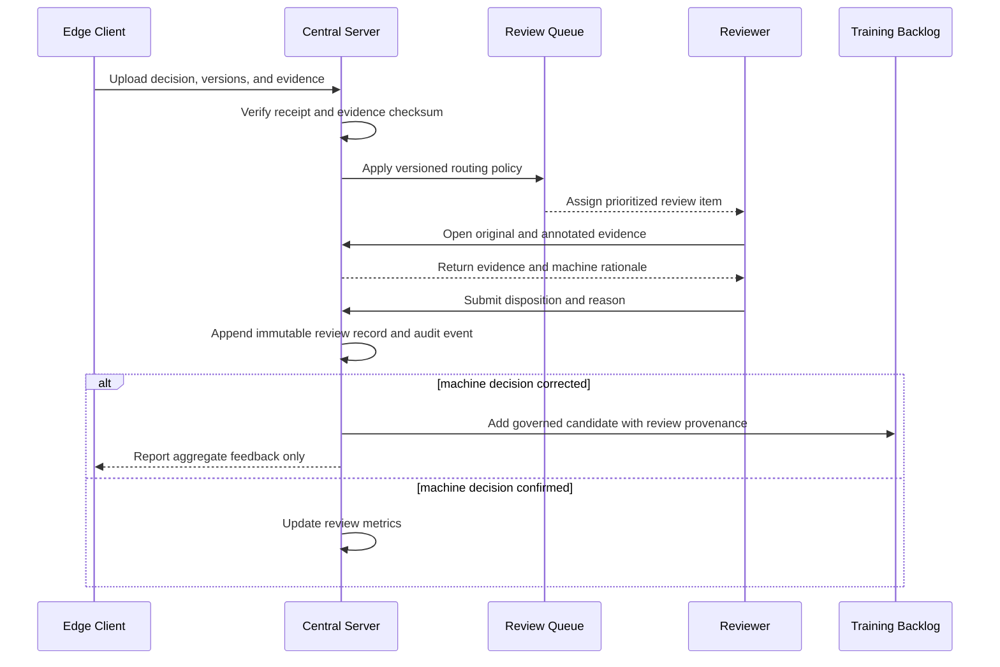

# 24. Human-in-the-Loop Operations

## 24.1 Purpose and Safety Position

Human review is a controlled quality process for cautious rollout, ambiguous evidence, NG disposition, and continuous improvement. It does not conceal model limitations or change the original machine decision. AssemblyVision prioritizes high NG recall: early operation accepts additional false NG decisions because they can be reviewed, while a real NG incorrectly released as OK is the principal quality risk.

Review is **optional and additive** (ADR-016): it is never required to run an
inspection, never mutates the immutable machine decision, and never changes the
existing inspection endpoints or projections. Any inspection — `OK` or `NG` —
may be reviewed locally on the edge; NG detail views surface a review entry
point while OK views offer an optional audit path.

## 24.2 Scope by Phase

### 24.2.1 Initial Production Phase

- Make all NG inspections available for review.
- Route business `NG` cases whose internal decision is `UNCERTAIN` to review as a distinct explanatory category.
- Audit a representative sample of OK inspections.
- Preserve original evidence, model/rule/configuration versions, and machine reason codes.
- Store reviewer corrections and route confirmed misclassifications to a governed training backlog.

### 24.2.2 Mature Production Target

- Adjust review routing separately by product, component, line, model, and rule version.
- Reduce manual review only after sufficient production evidence and customer approval.
- Continue risk-based OK sampling to estimate false negatives.
- Prioritize novel, low-quality, disagreement, and post-release cases.

### 24.2.3 Future Scope

- Reviewer-assistive clustering and active-learning suggestions.
- Dual review or adjudication for selected critical defect classes.
- MES disposition integration after interfaces and responsibilities are agreed.

Automated retraining and automatic production model promotion are outside the initial scope.

## 24.3 Reviewable Outcomes

The machine outcome remains immutable. A review adds a separate human disposition:

| Machine outcome | Review purpose | Allowed human disposition |
|---|---|---|
| `NG` | Confirm real defect or false NG | Confirmed NG, confirmed OK, inconclusive |
| Business `NG`, internal `UNCERTAIN` | Resolve insufficient/conflicting evidence | Confirmed NG, confirmed OK, recapture/reinspect, inconclusive |
| Sampled `OK` | Estimate missed defects and detect drift | Confirmed OK, corrected NG, inconclusive |
| System exception | Determine inspectability and recovery | Reinspect, operational fault, inconclusive |

An `NG` corrected to `OK` and a sampled `OK` confirmed share the `CONFIRMED_OK`
disposition; the original machine outcome on the review record distinguishes
them. The "system exception" row (including the operational-fault disposition)
is outside edge-local review scope and is deferred until central review exists
(ADR-016).

A correction does not rewrite the edge decision. It records reviewer, time, reason, ground-truth component states, evidence used, and relationship to the original inspection.

## 24.4 Review Queue Policy

Routing policy is versioned and auditable. Priority factors include:

1. Potential safety/quality impact of the missing component.
2. `UNCERTAIN`, no-product, barcode mismatch, or system exception.
3. New application/model/rule/product configuration rollout.
4. Low evidence margin or disagreement across frames.
5. Camera or image-quality degradation.
6. Underrepresented product/component combinations.
7. Age of the item and customer production workflow.

All-NG review is an initial rollout policy, not a permanent architecture requirement. The OK audit sample must be selected by a documented method rather than reviewer convenience. Sampling strata should prevent high-volume product types from hiding low-volume risks.

## 24.5 Manual Review Sequence

Review completion never pushes an ad hoc threshold or model change directly to an edge device.

## 24.6 Reviewer Interface Requirements

The central dashboard displays the original full/key frame, product ROI, annotated detections, per-frame evidence when retained, barcode/product mapping, missing and low-confidence components, image-quality reasons, and application/model/rule/configuration versions. The reviewer can zoom and toggle overlays without modifying source evidence.

Submission requires a disposition, per-component correction where applicable, reason code, and optional note. `Inconclusive` requires a reason such as insufficient evidence, wrong framing, occlusion, or unavailable ground truth. The UI prevents self-approval where dual control is configured and records reassignment, reopening, and adjudication.

## 24.7 Review Data Model and Auditability

A review record includes:

- Stable review and inspection identifiers.
- Queue policy/version and assignment history.
- Original machine outcome and reason codes.
- Reviewer disposition and component-level ground truth.
- Reviewer identity, role, timestamps, and reason.
- Evidence identifiers/checksums and versions shown.
- Superseded review reference if corrected.
- Adjudication state and adjudicator where required.
- Training-backlog eligibility and exclusion reason.

Review records are append-only. Corrections supersede rather than overwrite. Access and exports are audited.

## 24.8 Quality Control for Human Review

Reviewers need product-specific instructions and examples agreed with the customer. Quality controls include periodic calibration cases, blinded overlap review, disagreement analysis, and adjudication by an authorized product expert. Ground truth that cannot be established from retained evidence remains inconclusive and must not be forced to match the machine output.

Reviewer performance data is used to improve instructions and resolve ambiguity, not as a substitute for representative system evaluation.

## 24.9 Feedback and Model Improvement

Confirmed errors enter a candidate backlog with provenance and data-use permission. Before training use, an authorized curator checks image quality, product identity, component labels, leakage grouping, privacy, and duplicate/adjacent-frame relationships. Dataset versions record inclusion decisions.

The update cycle is:

1. Analyze errors by product, component, site condition, and release version.
2. Select representative, authorized examples and preserve held-out acceptance data.
3. Train or tune outside the production edge runtime.
4. Evaluate against locked regression and independent validation sets.
5. Approve a signed model/rule release through the normal release process.
6. Stage, monitor, and roll back if measured behavior regresses.

No individual review causes online learning or silently changes a production decision policy.

## 24.10 Metrics and Review Reduction

Track review rate, queue age, reviewer turnaround, correction rate, false-positive rate, estimated false-negative rate from OK audits, inconclusive rate, disagreement rate, and per-product/per-component/model/rule results. Every rate includes its sample count and sampling method.

Manual review is reduced only when measured production evidence supports the change. The decision considers NG recall, OK-audit findings, novelty, review correction rate, sample representativeness, recent camera/product/configuration changes, and customer risk tolerance. There is no fixed calendar date or unvalidated numeric trigger.

## 24.11 Operational Exceptions

- If the central server is unavailable, edge inspection continues and review items synchronize later.
- If required evidence is missing or corrupt, the review is inconclusive and an operational incident is raised.
- If queue growth exceeds staffing capacity, priority policy protects highest-risk items; it does not automatically convert NG to OK.
- If a reviewer discovers a potential missed-NG pattern, follow the containment runbook in [Observability and Support](23-observability-and-support.md).
- If product configuration changes, maintain separate review metrics before and after activation.

## 24.12 Open Questions and Validation Required

- How internal `UNCERTAIN` is displayed as a distinct review category while retaining business result `NG`.
- Who has authority to define ground truth, adjudicate disagreements, and release a product after review.
- Review staffing, shifts, languages, response expectations, and queue ownership.
- Initial and continuing OK audit sampling policy after production baseline measurement.
- Component criticality and review priority by product type.
- Evidence retention needed to complete delayed reviews and quality audits.
- Whether review outcomes integrate with PLC/MES or remain advisory in the first release.
- Customer permission and governance for using reviewed production evidence in training.

## 24.13 Related Documents

- [Testing and Quality Assurance](22-testing-and-quality-assurance.md)
- [Customer Acceptance](26-customer-acceptance.md)
- [Model update sequence](20-deployment-and-operations.md#208-model-and-rule-update-sequence)

## 24.14 Edge-Local Review (ADR-016)

While the mature design routes review through the central server (section
24.5), the edge stores append-only local review records so the process keeps
working while offline (section 24.11) and before a central server exists.
See [ADR-016](decisions/ADR-016-edge-local-human-review.md) for the scope
decisions: optional per-inspection review, disposition compatibility, local
reviewer identity, supersede chaining, and the web review queue.
