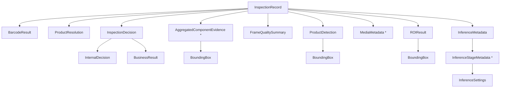

# 12 — Core Abstractions and Type Architecture

How this codebase abstracts its classes and types, and the rules for adding
new ones. This is the "class architecture" chapter: when to use a Pydantic
model, a frozen dataclass, or a `Protocol`, how the domain model is composed,
how errors become reason codes, and the patterns used across the runtime.

## The three abstraction mechanisms

The codebase uses exactly three mechanisms for its abstractions, chosen by
purpose:

| Mechanism | Used for | Examples |
|---|---|---|
| **Pydantic model** (`APIModel`) | Contracts that cross boundaries: persistence, API, config, manifests; validated, serializable, reject unknown fields | `InspectionRecord`, `ModelManifest`, `RuleDefinition`, `PipelineConfig`, `SubmitReviewRequest`, all API schemas |
| **Frozen dataclass** | Internal value objects / configuration that never cross a wire boundary; cheap, immutable, hashable | `CapturedFrame`, `CameraCapabilities`, `ROIConfig`, `GeneratedROI`, `Box`, `Transform`, `ComponentTemporalPolicy`, `FrameObservation`, `ProductWindow`, `RetentionPolicy`, `StorageState`, `UploadReceipt`, `MockProductSpec`, `ServerSettings` |
| **`Protocol`** (structural typing) | Plugin seams where a vendor/SDK/transport implementation must be swappable; runtime checkable | `FrameSource`, `BarcodeDecoder`, `TriggerSource`, `UploadSink`, `ModbusTcpTransport`, `ZXingDecodedBarcode` |

**Rule of thumb**: if a value crosses a boundary (persisted, serialized to
the API, loaded from config, part of a manifest) → Pydantic with
`extra="forbid"`. If it is purely internal plumbing → frozen dataclass. If it
is a swappable capability (camera, barcode reader, trigger, upload
destination) → `Protocol` + concrete implementations.

## Domain model (`packages/python/domain`)

### Base and enums

`APIModel(BaseModel)` with `model_config = ConfigDict(extra="forbid",
from_attributes=True)` — unknown fields are rejected loudly, ORM-style
attribute construction works. All domain models derive from it.

Enums are `StrEnum` (serialize as their string values):

| Enum | Values |
|---|---|
| `InternalDecision` | `OK`, `NG`, `UNCERTAIN` |
| `BusinessResult` | `OK`, `NG` (UNCERTAIN always maps to NG) |
| `InspectionLifecycle` | `OPEN`, `EVALUATING`, `COMPLETED`, `ABORTED` |
| `MediaLifecycle` | `PENDING`, `AVAILABLE`, `FAILED`, `PURGED` |
| `ReviewDisposition` | `CONFIRMED_NG`, `CONFIRMED_OK`, `CORRECTED_NG`, `INCONCLUSIVE`, `REINSPECT` |
| `ComponentCorrectionState` | `PRESENT`, `MISSING`, `UNCERTAIN` |

Where an enum value is not yet a `StrEnum` in the code (e.g. `UploadTask.status`,
`DeviceStatus.operational_state` are `Literal`s in the Pydantic models), treat
the literal strings as the canonical values — they are the same sets listed
in the API reference.

### The `InspectionRecord` composition graph



Key invariants baked into the model:
- `evidence[]` carries one `AggregatedComponentEvidence` per required
  component with state `PRESENT | MISSING | UNCERTAIN | UNVERIFIABLE`.
- `media[]` is metadata only (bytes live on disk); every entry has
  `relative_path`, `size_bytes`, `checksum_sha256`.
- Model/rule versions are pinned as UUIDs + checksums on the record; every
  inspection is fully reproducible from the record + media.
- `ReviewRecord` snapshots `original_business_result` /
  `original_internal_decision` / `original_reason_codes` — the machine
  decision is immutable; reviews are append-only (chain via
  `supersedes_review_id`).

## Protocol seams (how to abstract a swappable capability)

### `FrameSource` (vision-core)

```python
@runtime_checkable
class FrameSource(Protocol):
    def open(self) -> CameraCapabilities: ...
    def configure(self, settings: CameraSettings) -> AppliedSettings: ...
    def frames(self, stop: Event) -> Iterator[CapturedFrame]: ...
    def close(self) -> None: ...
```

Concrete implementations: `FolderSource`, `VideoFrameSource`,
`OpenCVCameraSource`, `RTSPFrameSource`, `HttpImageSource`,
`GigEVisionFrameSource`. Construction is centralized in
`build_frame_source(config)` (factory). The edge `CameraSourceManager` only
knows the protocol — vendor SDKs are isolated behind it (ADR-013). Add a
new source per `08-camera-sources-and-vision-core.md`.

### `BarcodeDecoder` (edge-service `barcode/`)

```python
class BarcodeDecoder(Protocol):
    def decode(self, image) -> tuple[BarcodeObservation, ...]: ...
```

`ZXingCppBarcodeDecoder` lazily loads `zxingcpp`; `KeyboardBarcodeInputAdapter`
parses simulated keyboard input (dev harness only). Observations carry
read/failure status so resolution can fail closed.

### `TriggerSource` (edge-service `trigger/`)

```python
class TriggerSource(Protocol):
    def events(self) -> Iterator[TriggerEvent]: ...
```

`MockTriggerSource` produces a deterministic identity sequence;
`IdentityCorrelator` stamps `CapturedFrame.product_identity`. The Modbus TCP
FIFO adapter (`ModbusTcpTriggerAdapter` behind the `ModbusTcpTransport`
protocol) is delivered as an opt-in contract; live transport is gated on a
site-validated register profile.

### `UploadSink` (edge-service `upload/`)

```python
class UploadSink(Protocol):
    def upload(self, task: UploadTask, payload: bytes) -> UploadResult: ...
```

`HttpUploadSink` POSTs the JSON envelope to `{base_url}/inspection-uploads`;
`DirectoryUploadSink` writes to a directory (receipt = idempotency key) for
dev/tests. The scheduler depends on the protocol, never a concrete sink.

### How to add a new seam

1. Define a `Protocol` with typed methods (document the failure contract:
   raise vs return status — e.g. sinks return `UploadResult`, sources raise
   `FrameStreamError`).
2. Add one concrete implementation per variant; keep vendor/SDK imports lazy
   behind a `_backend.py` helper with an optional-extras dependency.
3. Wire construction in the factory/composition root (`build_frame_source`,
   `cli._build_pipeline`, `EdgeRuntime.load_instances`).
4. Inject through constructors — never instantiate inside a consumer.
5. Test the concrete implementations with faked backends and test the
   protocol against a minimal structural fake
   (`test_frame_source_is_runtime_checkable_protocol` does exactly this).

## Composition root and dependency direction

There is **no DI framework**. Composition happens explicitly at the entry
points:

- `cli._build_pipeline` (CLI): loads config/rule/manifests, builds
  `ProductDetector`/`ComponentDetector`/`ROIEngine`/`RuleEngine`, then
  `InspectionPipeline(...)`.
- `api.app.create_app` (serve): builds `EdgeRepository`, `RuntimeEventBus`,
  `EdgeRuntime` (+ instances), then `UploadScheduler`/`RetentionCleanupWorker`
  and the FastAPI app; routers receive dependencies via `Depends(...)`
  accessors that read `request.app.state`.

Dependency direction (enforced by review, contract 01):

```text
api/routers → api (schemas, deps, problems) → application services (pipeline, runtime)
  → domain protocols/models (assemblyvision_domain, assemblyvision_vision)
infrastructure (persistence, upload, retention, output) implements protocols
  consumed by application services
```

Rules: routes never call YOLO or SQLAlchemy directly; the rule engine never
imports FastAPI/DB/YOLO; edge code never imports `training/`; shared
packages never read env vars at import time.

## Error hierarchy → reason codes

```text
AssemblyVisionError (packages/python/domain/errors.py)
├── ConfigError              # invalid config/rule/manifest → pipeline load fails, exit 2
├── ImageReadError           # image cannot be decoded
├── DetectionError           # carries .reason_code (e.g. INFERENCE_ERROR)
├── ROIGenerationError       # invalid ROI geometry
├── RuleEvaluationError      # rule evaluation itself failed
└── OutputError              # evidence cannot be durably persisted

FrameStreamError (vision-core) # frame source open/read/decode failure; never silently skipped
ApiProblem (edge api/problems.py)  # → application/problem+json response
```

**The pattern**: subsystems raise typed exceptions; at subsystem boundaries
they are converted to stable **reason codes** (canonical set in
`reason_codes.py`); inspection records carry only reason codes, never stack
traces. Fail-safe: any detection/ROI/read/rule failure merges into
`extra_reasons` and forces business `NG` — never `OK`.

## Patterns used across the runtime

| Pattern | Where |
|---|---|
| Repository | `EdgeRepository` — single access point for SQLite; typed methods, CAS transitions |
| Transactional outbox | `persist_inspection_and_enqueue_uploads` — inspection + media + tasks in one transaction |
| Adapter | All `Protocol` seams + concrete implementations |
| Strategy | `InspectionPipeline.inspect_frame` (single-frame) vs `inspect_window` (temporal aggregation) |
| State machine | `ProductWindowManager` (CloseReason), storage `PressureMode`, inspection/device/upload states via enums |
| Lease + fencing token | `UploadScheduler` claims, `RetentionCleanupWorker` deletion, review supersede (`BEGIN IMMEDIATE`) |
| Composition root | `cli._build_pipeline`, `create_app`, `EdgeRuntime.load_instances` |
| Fail-closed validation | `extra="forbid"` models, `PRAGMA quick_check`, manifest checksums, unknown-key rejection |
| Atomic filesystem writes | temp + fsync + rename (output writer, media, backup bundles) |

## Adding new types — decision checklist

- [ ] Crosses a boundary (API/persistence/config/manifest)? → Pydantic
  `APIModel` in `domain` (shared) or `api/schemas.py` (API-only),
  `extra="forbid"`, timezone-aware UTC datetimes, UUID strings.
- [ ] Internal value/configuration object? → `@dataclass(frozen=True)` with
  `__post_init__` validation (mirror `ROIConfig`/`ComponentTemporalPolicy`).
- [ ] Swappable capability? → `Protocol` + concrete implementations + factory
  wiring + fake-backend tests.
- [ ] New failure mode? → add a typed error subclass or reuse an existing
  one, and a stable reason code in `reason_codes.py` (with tests +
  documentation — reason codes are the enforceable source of truth).
- [ ] New state? → extend the relevant enum/Literal and its allowed
  transitions; add state-machine tests including stale-lease/fencing and
  restart-recovery paths.
